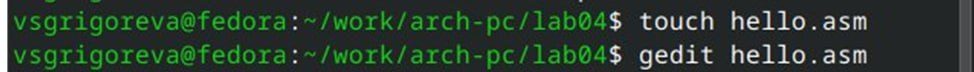
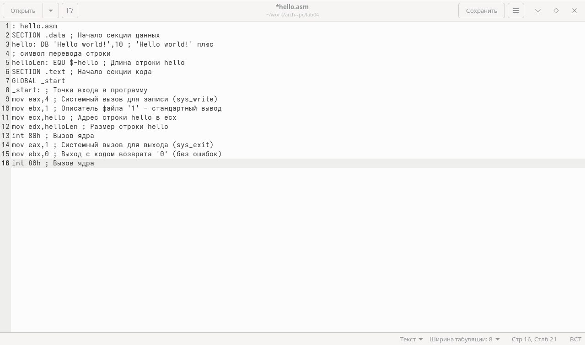
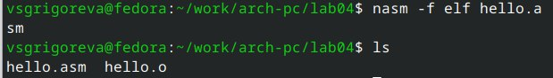
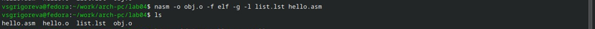
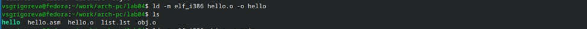
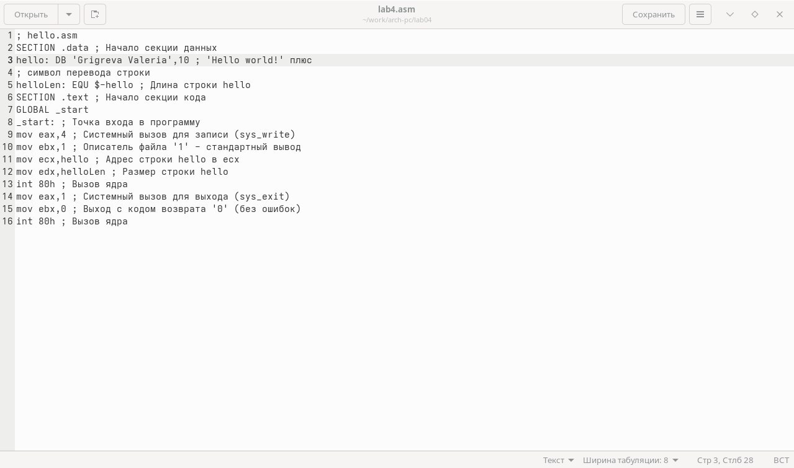
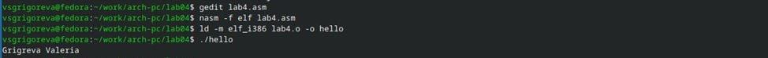

---
## Front matter
title: "Отчёт по лабораторной работе №4"
subtitle: "Выполнил студент НКАбд-02-25"
author: "Валерия Сергеевна Григорьева"

## Generic otions
lang: ru-RU
toc-title: "Содержание"

## Bibliography
bibliography: bib/cite.bib
csl: pandoc/csl/gost-r-7-0-5-2008-numeric.csl

## Pdf output format
toc: true # Table of contents
toc-depth: 2
lof: false # List of figures
lot: false # List of tables
fontsize: 12pt
linestretch: 1.5
papersize: a4
documentclass: scrreprt
## I18n polyglossia
polyglossia-lang:
  name: russian
  options:
  - spelling=modern
  - babelshorthands=true
polyglossia-otherlangs:
  name: english
## I18n babel
babel-lang: russian
babel-otherlangs: english
## Fonts
mainfont: "Liberation Serif"
romanfont: "Liberation Serif"
sansfont: "Liberation Sans"
monofont: "Liberation Mono"
mainfontoptions: Ligatures=TeX
romanfontoptions: Ligatures=TeX
sansfontoptions: Ligatures=TeX,Scale=MatchLowercase
monofontoptions: Scale=MatchLowercase,Scale=0.9
## Biblatex
biblatex: true
biblio-style: "gost-numeric"
biblatexoptions:
  - parentracker=true
  - backend=biber
  - hyperref=auto
  - language=auto
  - autolang=other*
  - citestyle=gost-numeric
## Pandoc-crossref LaTeX customization
figureTitle: "Рис."
tableTitle: "Таблица"
listingTitle: "Листинг"
lofTitle: "Порядок проведения лабораторной работы"
lotTitle: "Вывод"
lolTitle: "Листинги"
## Misc options
indent: true
header-includes:
  - \usepackage{indentfirst}
  - \usepackage{float} # keep figures where there are in the text
  - \floatplacement{figure}{H} # keep figures where there are in the text
---
# Цель работы
Цель данной работы — освоение процедуры компиляции и сборки программ, написанных на ассемблере NASM.

# Порядок выполнения лабораторной работы
В начале создала каталог для работы с программами на языке ассемблера NASM, а азтем перешла в него(Рисунок 2.1).

{#fig:ris1.jpg width=0.7\textwidth}

Далее создала текстовый файл с именем hello.asm с помощью команды touch и открыла его с помощью gedit(Рисунок 2.2).

{#fig:ris2.jpg width=0.7\textwidth}

Текстовый файл открылся, в него необходимо было ввести текст(Рисунок 2.3).

{#fig:ris3.jpg width=0.7\textwidth}

В ассемблерной программе каждая команда располгается на отдельной строке, а синтаксис ассемблера NASM является чувствительным к регистру.

Чтобы скомпилировать приведенный выше текст программы "Hello World", я использовала транслятор NASM с помощью команды "nasm -f elf hello.asm". Текст программы был набран правильно, поэтому транслятор преобразовал его из файла hello.asm в объектный код, записанный в файл hello.o. Ключ -f указывает транслятору, что требуется создать бинарные файлы в формате ELF. Далее с помощью комнады ls проверила, что нужный файл был создан(Рисунок 2.4). Объектный файл имеет имя hello.o.

{#fig:ris4.jpg width=0.7\textwidth}

Далее я выполнила команду, которая скомпилировала исходный файл hello.asm в obj.o (опция -o позволяет задать имя объектного файла, в данном случае obj.o), при этом формат выходного файла elf, в него включены символы для откладки с помощью опции -g, кроме того был создан файл листинга list.lst с помощью опции -l. Затем удостоверилась, что файлы бвли созданы с помощью ls(Рисунок 2.5).

{#fig:ris5.jpg width=0.7\textwidth}

Затем объектный файл я передала на обработку компановщику, чтобы получить исполняемую программу. Далее я проверила, что исполняемый файл hello был создан(Рисунок 2.6).

{#fig:ris6.jpg width=0.7\textwidth}

Компоновщик ld не предполагает по умолчанию расширений для файлов, но принято использовать следующие расширения: o – для объектных файлов; без расширения – для исполняемых файлов; map – для файлов схемы программы; lib – для библиотек. Ключ -o с последующим значением задаёт в данном случае имя создаваемого исполняемого файла.

Затем я выполнила команду ld -m elf_i386 obj.o -o main(Рисунок 2.7).

{#fig:ris7.jpg width=0.7\textwidth}

Исполняемый файл имеет имя main, объектный файл, из которого собран этот исполняемый файл - obj.o.

Чтобы запустиить на выполнение созданный исполняемый файл, находящийся в текущем каталоге, я набрала в командной строке ./hello(Рисунок 2.8).

{#fig:ris8.jpg width=0.7\textwidth}

# Задание для самостоятельной работы

1. В каталоге с лабораторной работой с помощью команды cp создала копию файла hello.asm с именем lab4.asm(Рисунок 2.9).

{#fig:ris9.jpg width=0.7\textwidth}

2, 3. С помощью текстового редактора gedit внесла изменения в текст программы в новом файле lab4.asm так, чтобы на экран выводилась строка с моим именем и фамилией(Рисунок 2.10).

{#fig:ris11.jpg width=0.7\textwidth}

Оттранслировала полученный текст в объектный файл, выполнила его компоновку и запустила получившийся исполняемый файл(Рисунок 2.11).

{#fig:ris10.jpg width=0.7\textwidth}

4. Далее я скопировала файлы hello.asm и lab4.asm в мой локальный репозиторий и загрузила их на github.

# Вывод

В процессе выполнения лабораторной работы я научилась создавать простую программу на языке ассемблера NASM, превращать текст программы в объектный код, компилировать файл, компоновать и запускать его.
