---
## Front matter
title: "Отчёт по лабораторной работе №5"
subtitle: "Выполнила студентка НКАбд-02-25"
author: "Валерия Сергеевна Григорьева"

## Generic otions
lang: ru-RU
toc-title: "Содержание"

## Bibliography
bibliography: bib/cite.bib
csl: pandoc/csl/gost-r-7-0-5-2008-numeric.csl

## Pdf output format
toc: true # Table of contents
toc-depth: 2
lof: false # List of figures
lot: false # List of tables
fontsize: 12pt
linestretch: 1.5
papersize: a4
documentclass: scrreprt
## I18n polyglossia
polyglossia-lang:
  name: russian
  options:
  - spelling=modern
  - babelshorthands=true
polyglossia-otherlangs:
  name: english
## I18n babel
babel-lang: russian
babel-otherlangs: english
## Fonts
mainfont: "Liberation Serif"
romanfont: "Liberation Serif"
sansfont: "Liberation Sans"
monofont: "Liberation Mono"
mainfontoptions: Ligatures=TeX
romanfontoptions: Ligatures=TeX
sansfontoptions: Ligatures=TeX,Scale=MatchLowercase
monofontoptions: Scale=MatchLowercase,Scale=0.9
## Biblatex
biblatex: true
biblio-style: "gost-numeric"
biblatexoptions:
  - parentracker=true
  - backend=biber
  - hyperref=auto
  - language=auto
  - autolang=other*
  - citestyle=gost-numeric
## Pandoc-crossref LaTeX customization
figureTitle: "Рис."
tableTitle: "Таблица"
listingTitle: "Листинг"
lofTitle: "Порядок проведения лабораторной работы"
lotTitle: "Вывод"
lolTitle: "Листинги"
## Misc options
indent: true
header-includes:
  - \usepackage{indentfirst}
  - \usepackage{float} # keep figures where there are in the text
  - \floatplacement{figure}{H} # keep figures where there are in the text
---
# Цель работы
Цель данной работы — приобретение навыков работы в Midnight Commander. Освоение инструкций языка ассемблера mov и int.

# Порядок выполнения лабораторной работы
В начале работы я открыла Midnight Commander с поощью команды mc (Рисунок 2.1).

{#fig:ris1.png width=0.7\textwidth}

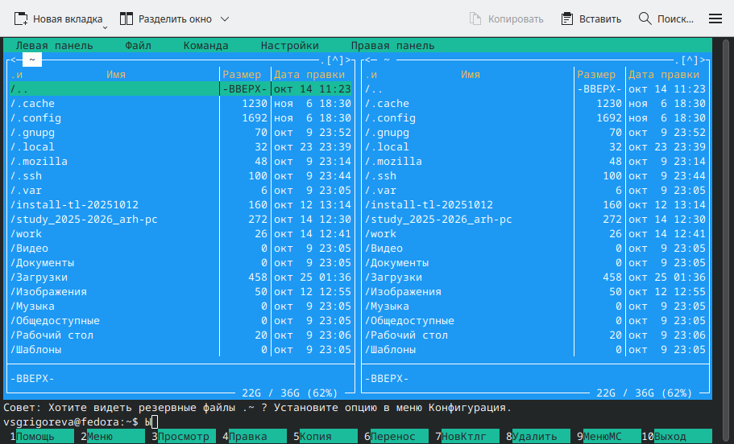{#fig:ris2.png width=0.7\textwidth}

Далее с помощью стрелок на клавиатуре и клавиши Enter я перешла в каталог ~/work/arch-pc, созданный при выполнении лабораторной работы №4 (Рисунок 2.3).

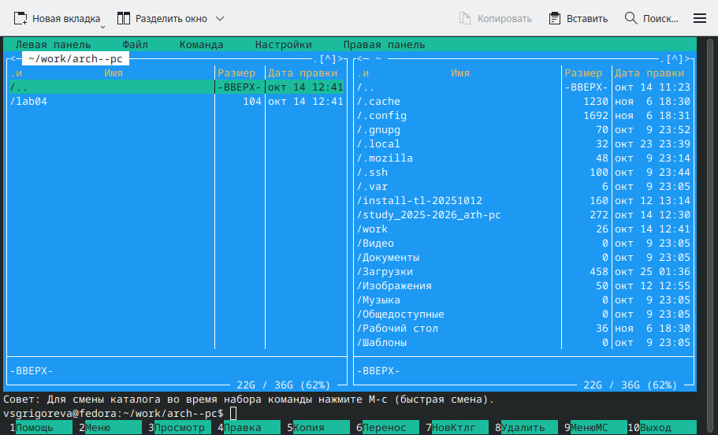{#fig:ris3.png width=0.7\textwidth}

Затем я создала папку lab05 с помощью клавиши F7 (Рисунок 2.4) и перешла в нее (Рисунок 2.5).

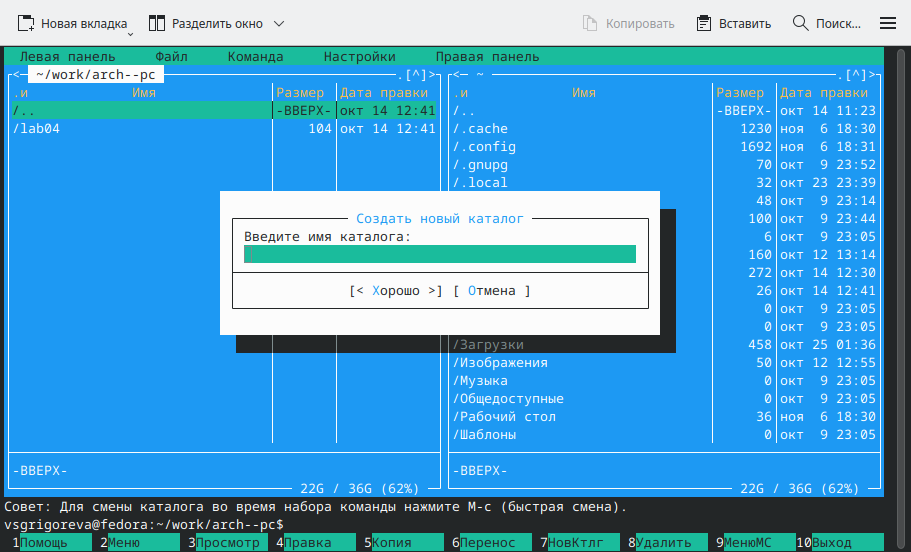{#fig:ris4.png width=0.7\textwidth}

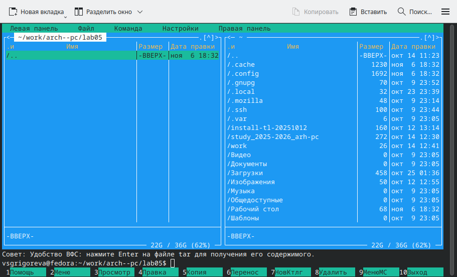{#fig:ris5.png width=0.7\textwidth}

Затем, пользуясь командной строкой внизу страницы, я создала файл lab5-1.asm с помощью команды touch (Рисунок 2.6).

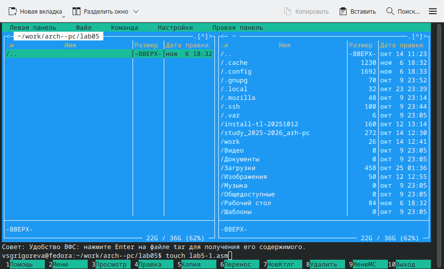{#fig:ris6.png width=0.7\textwidth}

С помощью клавиши F4 я открыла файл lab5-1.asm для редактирования во встроенном редакторе. У меня используется редактор mcedit. Затем я ввела текст программы из листинга 5.1 (Рисунок 2.7).

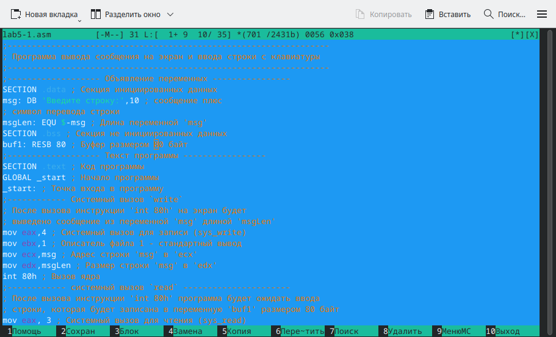{#fig:ris7.png width=0.7\textwidth}

Затем я сохранила файл с помощью клавиши F2 и вышла из редактора с помощью F10. 
Чтобы посмотреть файл и убедиться, что файл содержит текст программы, я нажала клавишу F3 (Рисунок 2.8).

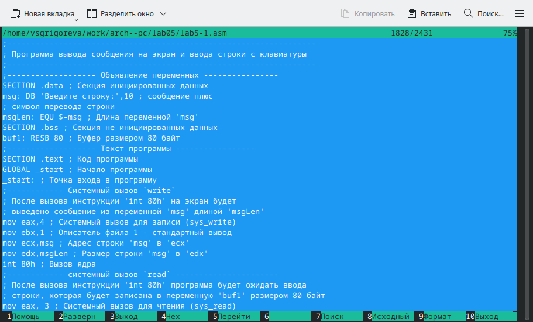{#fig:ris8.png width=0.7\textwidth}

Затем я оттранслировала текст программы в объектный файл, выполнила компоновку объектного файла и запустила его. Программа вывела строку 'Введите строку: ', я ввела ФИО (Рисунок 2.9). Программа корректно завершила работу.

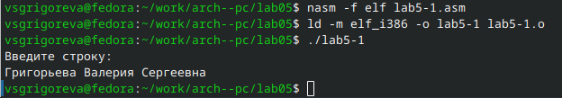{#fig:ris9.png width=0.7\textwidth}

Для упрощения написания программ часто встречающиеся одинаковые участки кода (такие как, например, вывод строки на экран или выход их программы) можно оформить в виде подпрограмм и сохранить в отдельные файлы, а во всех нужных местах поставить вызов нужной подпрограммы. NASM позволяет подключать внешние файлы с помощью директивы %include, которая предписывает ассемблеру заменить эту директиву содержимым файла.
Для выполнения лабораторных работ используется файл in_out.asm.
Для начала работы я скачала его со страницы курса в ТУИС. Так как подключаемый файл должен находится в том же каталоге, что и файл с программой, в которой он используется, необходимо было переместить его. С помощью клавиши F5 я скопировала файл (Рисунок 2.10).

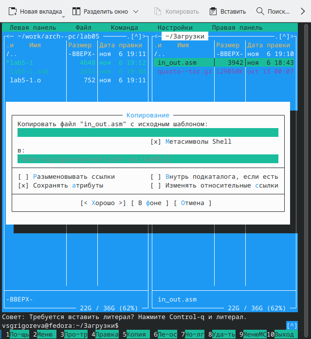{#fig:ris10.png width=0.7\textwidth}

С помощью клавиши F6 создала копию файла lab5-1.asm с именем lab5-2.asm. Затем я исправила текст программы в файле lab5-2.asm с использованием подпрограмм из внешнего файла in_out.asm (Рисунок 2.11).

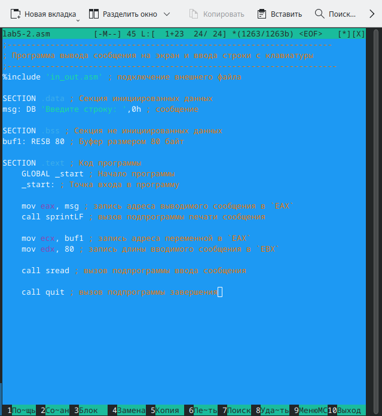{#fig:ris12.png width=0.7\textwidth}

Чтобы посмотреть файл и убедиться, что он содержит текст программы, я нажала клавишу F3 (Рисунок 2.12).

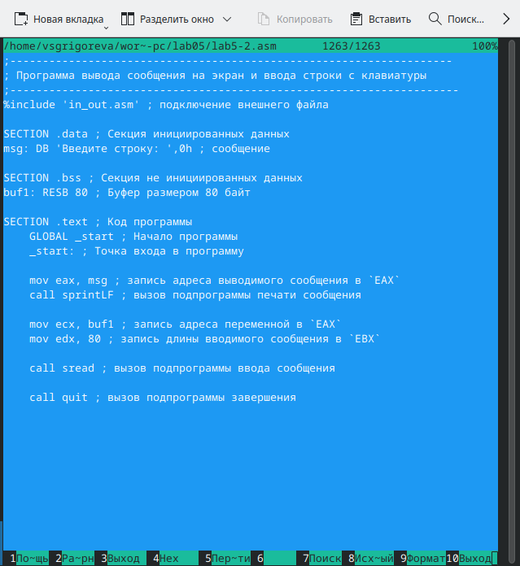{#fig:ris13.png width=0.7\textwidth}

Затем я оттранслировала текст программы в объектный файл, выполнила компоновку объектного файла и запустила его. Программа вывела строку 'Введите строку: ', я ввела ФИО (Рисунок 2.13). Программа корректно завершила работу.

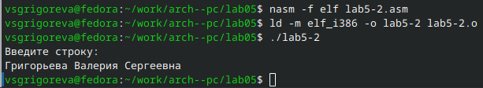{#fig:ris14.png width=0.7\textwidth}

В файле lab5-2.asm заменила подпрограмму sprintLF на sprint (Рисунок 2.14).

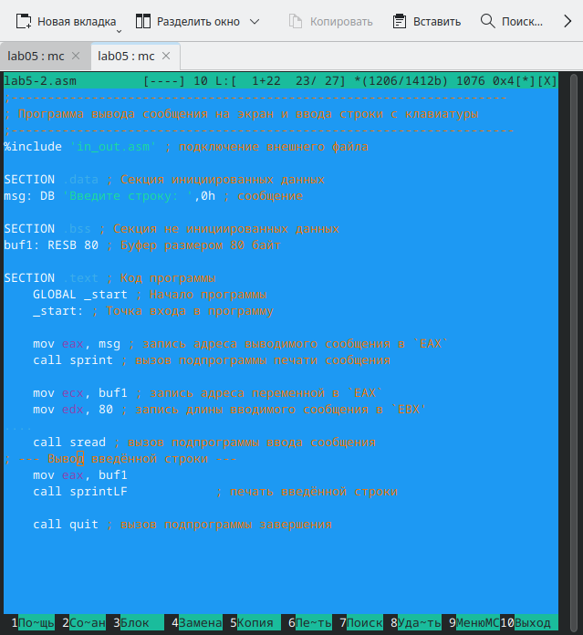{#fig:ris11.png width=0.7\textwidth}

Затем я оттранслировала его в объектный файл и запустила его. Программа вывела строку 'Введите строку: ', я ввела ФИО (Рисунок 2.15). Программа корректно завершила работу.

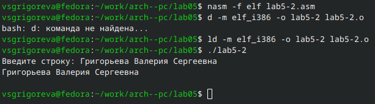{#fig:ris15.png width=0.7\textwidth}

При вводе команды sprintLF в текст программы, происходит перенос строки на следующую, а при sprint программа предлагает ввести текст на той же строке, на которой выводится запрос.

# Задание для самостоятельной работы

1, 2. Я создала с помощью клавиши F6 копию файла lab5-1.asm, которую назвала lab5-11.asm. Затем я внесла изменения в программу таким образом, чтобы она выводила строку, которую я ввела (Рисунок 3.1). 

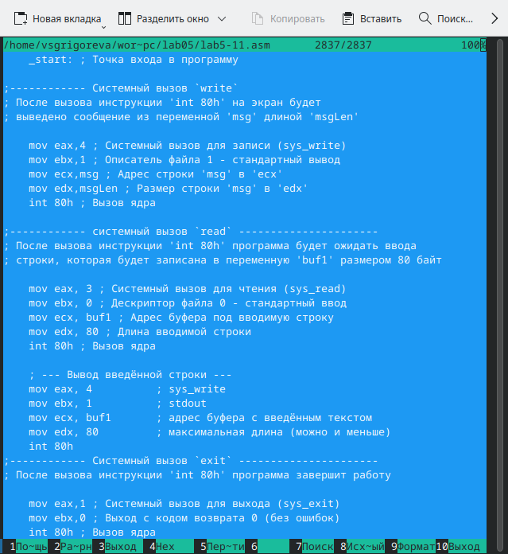{#fig:ris17.png width=0.7\textwidth}

В листинге [@lst:lab5-11] представлена программа lab5-11.asm, реализующая ввод строки с клавиатуры и её последующий вывод на экран.

```asm {#lst:lab5-11 caption="Программа lab5-11.asm — ввод и вывод строки"}
;------------------------------------------------------------------
; Программа вывода сообщения на экран и ввода строки с клавиатуры
;------------------------------------------------------------------
;------------------- Объявление переменных ----------------
SECTION .data ; Секция инициированных данных
msg: DB 'Введите строку:',10 ; сообщение плюс
; символ перевода строки
msgLen: EQU $-msg ; Длина переменной 'msg'
SECTION .bss ; Секция не инициированных данных
buf1: RESB 80 ; Буфер размером 80 байт
;------------------- Текст программы -----------------
SECTION .text ; Код программы
GLOBAL _start ; Начало программы
_start: ; Точка входа в программу
;------------ Cистемный вызов `write`
; После вызова инструкции 'int 80h' на экран будет
; выведено сообщение из переменной 'msg' длиной 'msgLen'
mov eax,4 ; Системный вызов для записи (sys_write)
mov ebx,1 ; Описатель файла 1 - стандартный вывод
mov ecx,msg ; Адрес строки 'msg' в 'ecx'
mov edx,msgLen ; Размер строки 'msg' в 'edx'
int 80h ; Вызов ядра
;------------ системный вызов `read` ----------------------
; После вызова инструкции 'int 80h' программа будет ожидать ввода
; строки, которая будет записана в переменную 'buf1' размером 80 байт
mov eax, 3 ; Системный вызов для чтения (sys_read)
mov ebx, 0 ; Дескриптор файла 0 - стандартный ввод
mov ecx, buf1 ; Адрес буфера под вводимую строку
mov edx, 80 ; Длина вводимой строки
int 80h ; Вызов ядра
    ; --- Вывод введённой строки ---
    mov eax, 4          ; sys_write
    mov ebx, 1          ; stdout
    mov ecx, buf1       ; адрес буфера с введённым текстом
    mov edx, 80         ; максимальная длина (можно и меньше)
    int 80h
;------------ Системный вызов `exit` ----------------------
; После вызова инструкции 'int 80h' программа завершит работу
mov eax,1 ; Системный вызов для выхода (sys_exit)
mov ebx,0 ; Выход с кодом возврата 0 (без ошибок)
int 80h ; Вызов ядра
```

Далее я получила исполняемый файл и проверила его работу (Рисунок 3.2). Программа вывела введенную мной строку и корректно завершила работу.

{#fig:ris17.png width=0.7\textwidth}

3, 4. С помощью клавиши F6 я создала копию файла lab5-2.asm, которую назвала lab5-22.asm, и в ней дописала текст таким образом, чтобы программа выводила введенную строку на экран (Рисунок 3.3). 

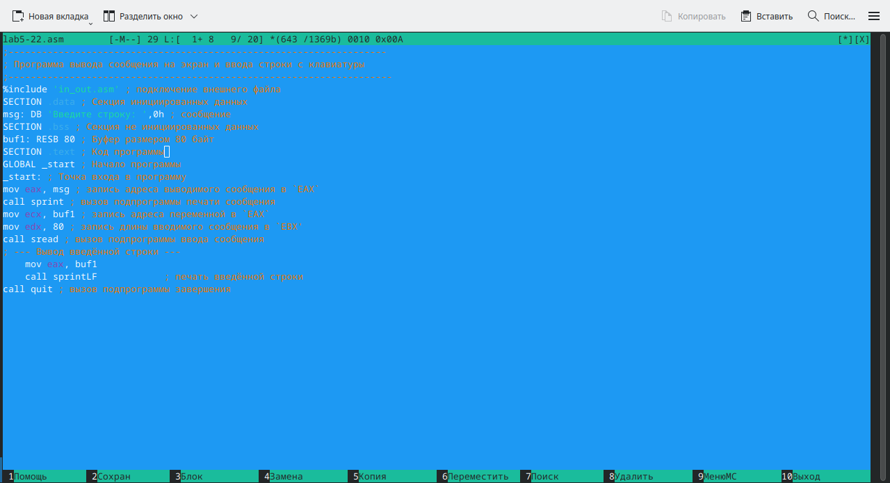{#fig:ris19.png width=0.7\textwidth}

В листинге [@lst:lab5-22] представлена программа lab5-22.asm, реализующая ввод строки с клавиатуры и её последующий вывод на экран.

```asm {#lst:lab5-11 caption="Программа lab5-11.asm — ввод и вывод строки"}
;--------------------------------------------------------------------
; Программа вывода сообщения на экран и ввода строки с клавиатуры
;---------------------------------------------------------------------
%include 'in_out.asm' ; подключение внешнего файла
SECTION .data ; Секция инициированных данных
msg: DB 'Введите строку: ',0h ; сообщение
SECTION .bss ; Секция не инициированных данных
buf1: RESB 80 ; Буфер размером 80 байт
SECTION .text ; Код программы
GLOBAL _start ; Начало программы
_start: ; Точка входа в программу
mov eax, msg ; запись адреса выводимого сообщения в `EAX`
call sprint ; вызов подпрограммы печати сообщения
mov ecx, buf1 ; запись адреса переменной в `EAX`
mov edx, 80 ; запись длины вводимого сообщения в `EBX'
call sread ; вызов подпрограммы ввода сообщения
; --- Вывод введённой строки ---
    mov eax, buf1
    call sprintLF            ; печать введённой строки
call quit ; вызов подпрограммы завершени
```

Затем я создала исполняемый файл и проверила его работу (Рисунок 3.4). Программа вывела введенную мной строку и корректно завершила работу.

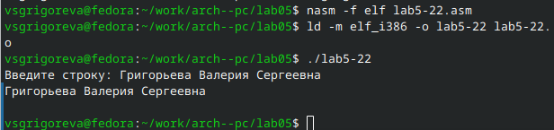{#fig:ris20.png width=0.7\textwidth}

# Вывод

В ходе лабораторной работы я приобрела практические навыки работы в Midnight Commander, освоила инструкции языка ассемблера mov и int. 
