---
## Front matter
title: "Отчёт по лабораторной работе №6"
subtitle: "Выполнила студентка НКАбд-02-25"
author: "Валерия Сергеевна Григорьева"

## Generic otions
lang: ru-RU
toc-title: "Содержание"

## Bibliography
bibliography: bib/cite.bib
csl: pandoc/csl/gost-r-7-0-5-2008-numeric.csl

## Pdf output format
toc: true # Table of contents
toc-depth: 2
lof: false # List of figures
lot: false # List of tables
fontsize: 12pt
linestretch: 1.5
papersize: a4
documentclass: scrreprt
## I18n polyglossia
polyglossia-lang:
  name: russian
  options:
  - spelling=modern
  - babelshorthands=true
polyglossia-otherlangs:
  name: english
## I18n babel
babel-lang: russian
babel-otherlangs: english
## Fonts
mainfont: "Liberation Serif"
romanfont: "Liberation Serif"
sansfont: "Liberation Sans"
monofont: "Liberation Mono"
mainfontoptions: Ligatures=TeX
romanfontoptions: Ligatures=TeX
sansfontoptions: Ligatures=TeX,Scale=MatchLowercase
monofontoptions: Scale=MatchLowercase,Scale=0.9
## Biblatex
biblatex: true
biblio-style: "gost-numeric"
biblatexoptions:
  - parentracker=true
  - backend=biber
  - hyperref=auto
  - language=auto
  - autolang=other*
  - citestyle=gost-numeric
## Pandoc-crossref LaTeX customization
figureTitle: "Рис."
tableTitle: "Таблица"
listingTitle: "Листинг"
lofTitle: "Порядок проведения лабораторной работы"
lotTitle: "Вывод"
lolTitle: "Листинги"
## Misc options
indent: true
header-includes:
  - \usepackage{indentfirst}
  - \usepackage{float} # keep figures where there are in the text
  - \floatplacement{figure}{H} # keep figures where there are in the text
---
# Цель работы
Цель данной работы - освоение арифметических инструкций языка ассемблера NASM.

# Порядок выполнения лабораторной работы

## Cимвольные и численные данные в NASM
Для начала работы я создала каталог для лабораторной работы №6, перешла в него и создала там файл lab6-1.asm (Рисунок 2.1).

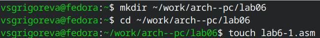{#fig:1.png width=0.7\textwidth}

Затем я ввела в файл lab6-1.asm текст программы из листинга 1 (Рисунок 2.2).

```nasm
%include 'in_out.asm'

SECTION .bss
buf1: RESB 80

	SECTION .text
	GLOBAL _start
	 _start:
	 
	 mov eax,'6'
	 mov ebx,'4'
	 add eax,ebx
	 mov [buf1],eax
	 mov eax,buf1
	 call sprintLF

	 call quit
```

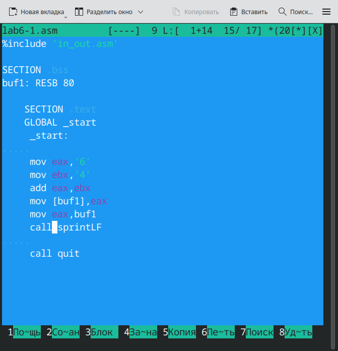{#fig:2.png width=0.7\textwidth}

В данной программе в регистр eax записывается символ 6 (mov eax,'6'), в регистр ebx символ 4 (mov ebx,'4'). Далее к значению в регистре eax прибавляется значение регистра ebx (add eax,ebx, результат сложения запишется в регистр eax). Далее выводится результат. Так как для работы функции sprintLF в регистр eax должен быть записан адрес, необходимо использовать дополнительную переменную. Для этого запишем значение регистра eax в переменную buf1 (mov [buf1],eax), а затем запишем адрес переменной buf1 в регистр eax (mov eax,buf1) и вызовем функцию sprintLF.

Затем я создала исполняемый файл и запустила его (Рисунок 2.3).
Для корректной работы программы скопировала файл in_out.asm в каталог с файлом lab6-1.asm.

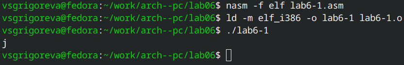{#fig:3.png width=0.7\textwidth}

Программа вывела не число 10, а символ j, потому что код символа 6 равен 00110110 в двоичном представлении (или 54 в десятичном представлении), а код символа 4 – 00110100 (52). Команда add eax,ebx запишет в регистр eax сумму кодов – 01101010 (106), что в свою очередь является кодом символа j в таблицу ASCII.

Далее изменила текст программы. Строки mov eax,'6' и mov ebx,'4' заменила на mov eax,6 mov ebx,4 (Рисунок 2.4).

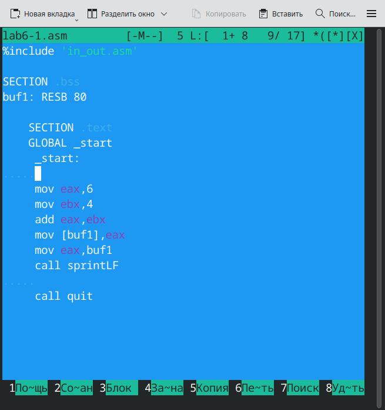{#fig:4.png width=0.7\textwidth}

Затем создала исполнемый файл и запустила его (Рисунок 2.5).

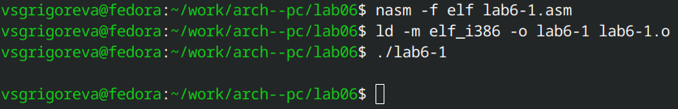{#fig:5.png width=0.7\textwidth}

Как и в предыдущем случае программа не вывела число 10, она должна была вывести символ с кодом 10 (черный квадрат с белым кругом внутри), но этот символ не отобразился на экране.

Далее необходимо было создать файл lab6-2.asm в каталоге ~/work/arch-pc/lab06 (Рисунок 2.6).

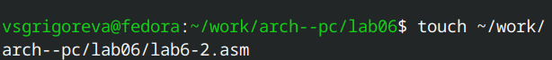{#fig:6.png width=0.7\textwidth}

Затем я ввела в него текст программы из листинга 2 (Рисунок 2.7).

```nasm
%include 'in_out.asm'

 SECTION .text
 GLOBAL _start
  _start:

   mov eax,'6'
   mov ebx,'4'
   add eax,ebx
   call iprintLF

   call quit
```

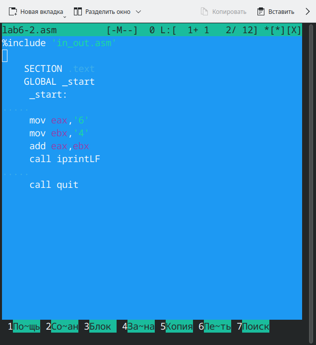{#fig:7.png width=0.7\textwidth}

Затем я создала исполняемый файл и запустила его (Рисунок 2.8).

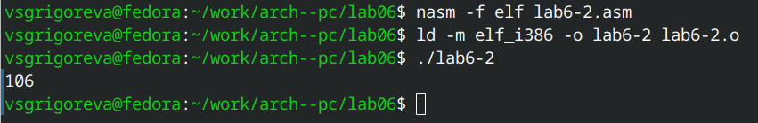{#fig:8.png width=0.7\textwidth}

В результате работы программы на экран вывелось число 106. В данном случае, как и в первом, команда add складывает коды символов ‘6’ и ‘4’ (54+52=106). Однако, в отличии от программы
из листинга 1, функция iprintLF позволяет вывести число, а не символ, кодом которого является это число.

Затем в программе lab6-2.asm я заменила строки mov eax,'6' и mov ebx,'4' на строки mov eax,6 и mov ebx,4 (Рисунок 2.9).

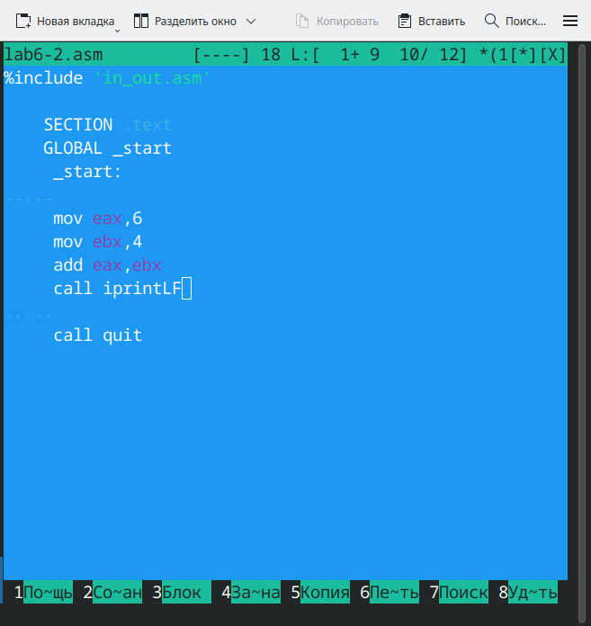{#fig:9.png width=0.7\textwidth}

Далее я создала исполняемый файл и запустила его (Рисунок 2.10). Программа вывела число 10.

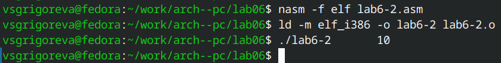{#fig:10.png width=0.7\textwidth}

Затем я заменила функцию iprintLF на iprint (Рисунок 2.11).

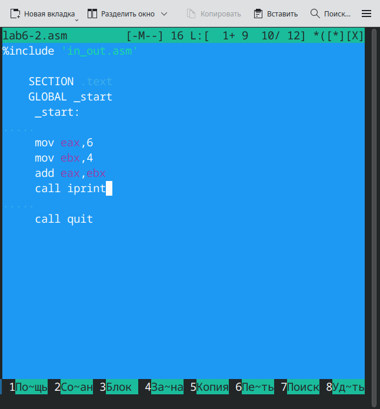{#fig:11.png width=0.7\textwidth}

Далее я создала исполняемый файл и запустила его (Рисунок 2.12). Программа вывела число 10, но в начале следующей строки.

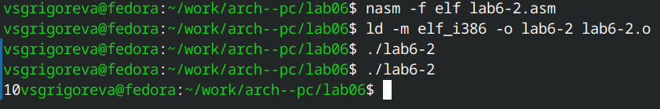{#fig:12.png width=0.7\textwidth}

## Выполнение арифметических операций в NASM

Сначала я создала файл lab6-3.asm в каталоге ~/work/arch-pc/lab06 (Рисунок 2.13).

{#fig:13.png width=0.7\textwidth}

Далее вставила в него текст программы из листинга 3 (Рисунок 2.14).

```nasm 
;--------------------------------
; Программа вычисления выражения
;--------------------------------

%include 'in_out.asm' ; подключение внешнего файла

 SECTION .data

 div: DB 'Результат: ',0
 rem: DB 'Остаток от деления: ',0
 
 SECTION .text
 GLOBAL _start
  _start:

  ; ---- Вычисление выражения
   mov eax,5 ; EAX=5
   mov ebx,2 ; EBX=2
   mul ebx ; EAX=EAX*EBX
   add eax,3 ; EAX=EAX+3
   xor edx,edx ; обнуляем EDX для корректной работы div
   mov ebx,3 ; EBX=3
   div ebx ; EAX=EAX/3, EDX=остаток от деления
   
   mov edi,eax ; запись результата вычисления в 'edi'

   ; ---- Вывод результата на экран

   mov eax,div ; вызов подпрограммы печати
   call sprint ; сообщения 'Результат: '
   mov eax,edi ; вызов подпрограммы печати значения
   call iprintLF ; из 'edi' в виде символов

   mov eax,rem ; вызов подпрограммы печати
   call sprint ; сообщения 'Остаток от деления: '
   mov eax,edx ; вызов подпрограммы печати значения
   call iprintLF ; из 'edx' (остаток) в виде символов

   call quit ; вызов подпрограммы завершения
```

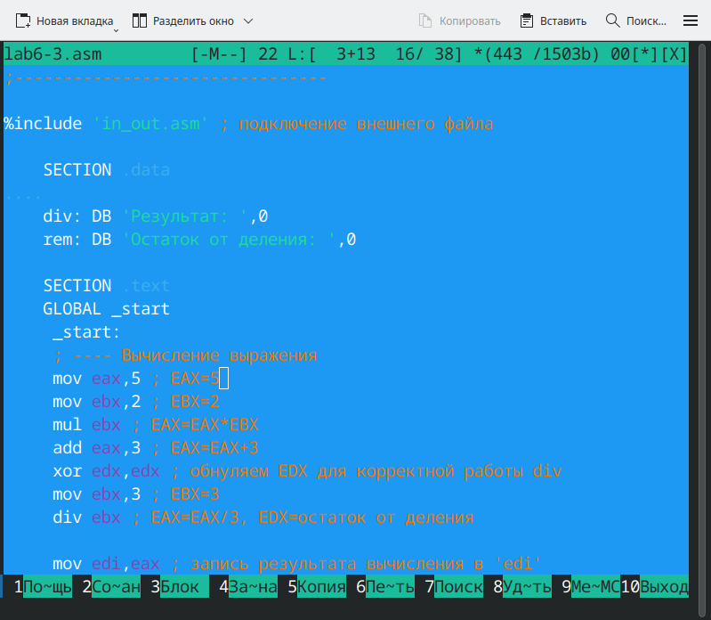{#fig:14.png width=0.7\textwidth}

Далее я создала исполняемый файл и запустила его (Рисунок 2.15).

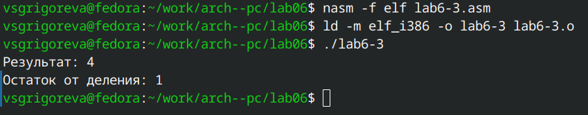{#fig:15.png width=0.7\textwidth}

Далее я изменила текст программы для вычисления выражения f(x) = (4*6+2)/5 (Рисунок 2.16). Измененный текст приведен в листинге 4.

```nasm
;--------------------------------
; Программа вычисления выражения f(x) = (4 * 6 + 2) / 5
;--------------------------------

%include 'in_out.asm' ; подключение внешнего файла

SECTION .data
div: DB 'Результат: ',0
rem: DB 'Остаток от деления: ',0

SECTION .text
GLOBAL _start

_start:
    ; ---- Вычисление выражения ----
    mov eax,4       ; EAX = 4
    mov ebx,6       ; EBX = 6
    mul ebx         ; EAX = 4 * 6 = 24

    add eax,2       ; EAX = 24 + 2 = 26

    xor edx,edx     ; Обнуляем EDX перед делением
    mov ebx,5       ; EBX = 5
    div ebx         ; EAX = 26 / 5 = 5, EDX = 1 (остаток)

    mov edi,eax     ; Сохраняем результат в EDI

    ; ---- Вывод результата ----
    mov eax,div
    call sprint     ; Печать "Результат: "

    mov eax,edi
    call iprintLF   ; Печать результата (5)

    mov eax,rem
    call sprint     ; Печать "Остаток от деления: "

    mov eax,edx
    call iprintLF   ; Печать остатка (1)

    call quit       ; Завершение программы
```

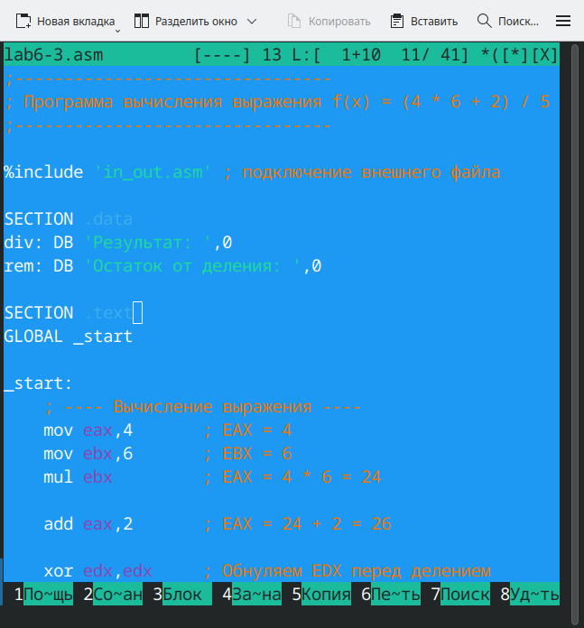{#fig:16.png width=0.7\textwidth}

Далее я создала исполняемый файл и проверила его работу (Рисунок 2.17).

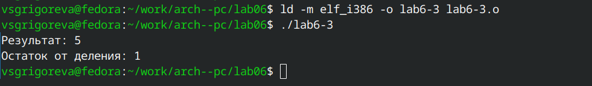{#fig:17.png width=0.7\textwidth}

Затем необходимо было рассмотреть программу вычисления варианта задания по номеру студенческого билета. В данном случае число, над которым необходимо проводить арифметические операции, вводится с клавиатуры. Ввод с клавиатуры осуществляется в символьном виде и для корректной работы арифметических операций в NASM символы необходимо преобразовать в числа. Для этого может быть использована функция atoi из файла in_out.asm.

Я создала файл variant.asm в каталоге ~/work/arch-pc/lab06 (Рисунок 2.18).

{#fig:18.png width=0.7\textwidth}

Затем в этот файл я записала текст программы из листинга 5 в файл variant.asm (Рисунок 2.19).

```nasm
;--------------------------------
; Программа вычисления варианта
;--------------------------------

%include 'in_out.asm'

 SECTION .data
 msg: DB 'Введите № студенческого билета: ',0
 rem: DB 'Ваш вариант: ',0
 
 SECTION .bss
 x: RESB 80
 
 SECTION .text
 GLOBAL _start
  _start:

   mov eax, msg
   call sprintLF
   
   mov ecx, x
   mov edx, 80
   call sread
 
   mov eax,x ; вызов подпрограммы преобразования
   call atoi ; ASCII кода в число, `eax=x`
   xor edx,edx
   mov ebx,20
   div ebx
   inc edx

   mov eax,rem
   call sprint
   mov eax,edx
   call iprintLF

   call quit
```

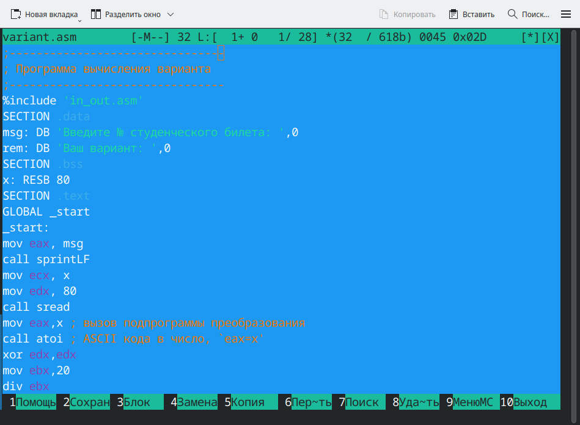{#fig:19.png width=0.7\textwidth}

Затем создала исполняемый файл и запустила его (Рисунок 2.20). У меня 15 вариант.

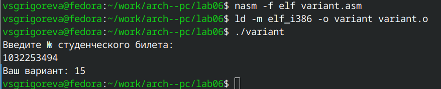{#fig:20.png width=0.7\textwidth}

Ответы на вопросы: 
1. Какие строки листинга 6.4 отвечают за вывод на экран сообщения ‘Ваш вариант:’?
Ответ:    mov eax,rem и call sprint
2. Для чего используется следующие инструкции?
mov ecx, x
mov edx, 80
call sread
Ответ: для ввода номера студенческого билета с клавиатуры и сохранения введённых символы в переменной x
3. Для чего используется инструкция “call atoi”?
Ответ: для преобразования символов в числа.
4. Какие строки листинга 6.4 отвечают за вычисления варианта?
Ответ: xor edx, edx  mov ebx, 20  div ebx  inc edx
5. В какой регистр записывается остаток от деления при выполнении инструкции “div ebx”?
Ответ: в регистр EDX
6. Для чего используется инструкция “inc edx”?
Ответ: для увеличения значения регистра EDX на 1
7. Какие строки листинга 6.4 отвечают за вывод на экран результата вычислений
Ответ: mov eax, rem  call sprint  mov eax, edx  call iprintLF

# Задание для самостоятельной работы

Сначала я создала файл sam.asm (Рисунок 3.1).

{#fig:21.png width=0.7\textwidth}

Затем я написала программу вычисления выражения y = f(x) = (5 + x)2 − 3. Программа должна была выводить выражение для вычисления, выводить запрос на ввод значения x1, вычислять заданное выражение в зависимости от введенного x1, выводить результат вычислений (Рисунок 3.2). Текст программы приведен в листинге 6.

```nasm
;--------------------------------
; Программа вычисления выражения
;--------------------------------
%include 'in_out.asm' ; подключение внешнего файла

SECTION .data
msg1: DB 'Вычисление выражения: f(x) = (5 + x)^2 - 3',0
msg2: DB 'Введите значение x: ',0
msg3: DB 'Результат: ',0

SECTION .bss
x: RESB 80 ; буфер для ввода

SECTION .text
GLOBAL _start

_start:
    ; ---- Вывод выражения ----
    mov eax, msg1
    call sprintLF

    ; ---- Ввод x ----
    mov eax, msg2
    call sprint
    mov ecx, x
    mov edx, 80
    call sread

    mov eax, x
    call atoi        ; преобразование строки в число, результат в EAX

    ; ---- Вычисление f(x) = (5 + x)^2 - 3 ----
    add eax, 5       ; EAX = 5 + x
    mov ebx, eax     ; EBX = (5 + x)
    mul ebx          ; EAX = (5 + x)^2
    sub eax, 3       ; EAX = (5 + x)^2 - 3
    mov edi, eax     ; сохранить результат

    ; ---- Вывод результата ----
    mov eax, msg3
    call sprint
    mov eax, edi
    call iprintLF

    ; ---- Завершение ----
    call quit
```

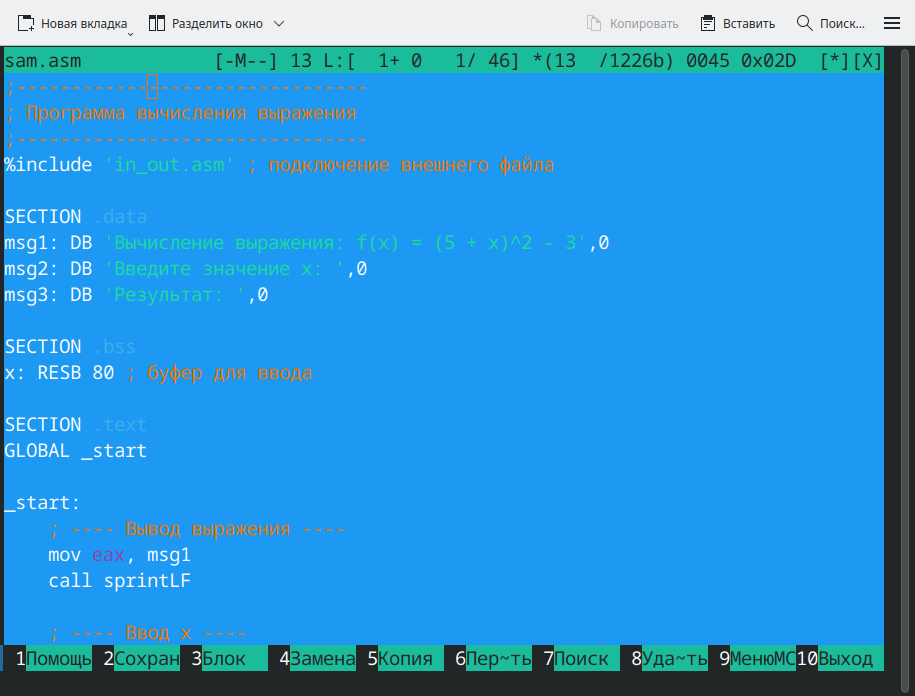{#fig:22.png width=0.7\textwidth}

Далее я создала исполняемый фал и проверила его работу для значений 5 и 1 (Рисунок 3.3). Программа корректно посчитала и завершила работу.

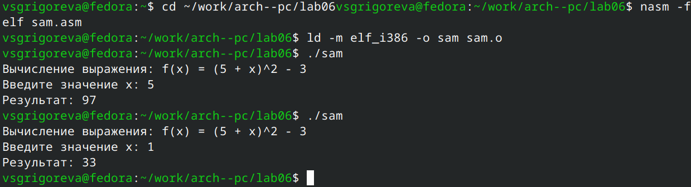{#fig:23.png width=0.7\textwidth}

# Вывод
В ходе выполнения работы я освоила арифметические инструкции языка ассемблера NASM.
