---
## Front matter
title: "Отчёт по лабораторной работе №7"
subtitle: "Выполнила студентка НКАбд-02-25"
author: "Валерия Сергеевна Григорьева"

## Generic otions
lang: ru-RU
toc-title: "Содержание"

## Bibliography
bibliography: bib/cite.bib
csl: pandoc/csl/gost-r-7-0-5-2008-numeric.csl

## Pdf output format
toc: true # Table of contents
toc-depth: 2
lof: false # List of figures
lot: false # List of tables
fontsize: 12pt
linestretch: 1.5
papersize: a4
documentclass: scrreprt
## I18n polyglossia
polyglossia-lang:
  name: russian
  options:
  - spelling=modern
  - babelshorthands=true
polyglossia-otherlangs:
  name: english
## I18n babel
babel-lang: russian
babel-otherlangs: english
## Fonts
mainfont: "Liberation Serif"
romanfont: "Liberation Serif"
sansfont: "Liberation Sans"
monofont: "Liberation Mono"
mainfontoptions: Ligatures=TeX
romanfontoptions: Ligatures=TeX
sansfontoptions: Ligatures=TeX,Scale=MatchLowercase
monofontoptions: Scale=MatchLowercase,Scale=0.9
## Biblatex
biblatex: true
biblio-style: "gost-numeric"
biblatexoptions:
  - parentracker=true
  - backend=biber
  - hyperref=auto
  - language=auto
  - autolang=other*
  - citestyle=gost-numeric
## Pandoc-crossref LaTeX customization
figureTitle: "Рис."
tableTitle: "Таблица"
listingTitle: "Листинг"
lofTitle: "Порядок проведения лабораторной работы"
lotTitle: "Вывод"
lolTitle: "Листинги"
## Misc options
indent: true
header-includes:
  - \usepackage{indentfirst}
  - \usepackage{float} # keep figures where there are in the text
  - \floatplacement{figure}{H} # keep figures where there are in the text
---
# Цель работы
Цель данной работы - изучение команд условного и безусловного переходов. Приобретение навыков написания программ с использованием переходов. Знакомство с назначением и структурой файла листинга

# Порядок выполнения лабораторной работы

## Реализация переходов в NASM
Для начала работы я создала каталог для лабораторной работы №7, перешла в него и создала файл lab7-1.asm (Рисунок 2.1).

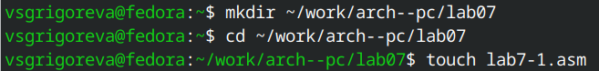{#fig:1.png width=0.7\textwidth}

Затем я ввела в файл lab7-1.asm текст программы из листинга 1 (Рисунок 2.2).

```nasm
%include 'in_out.asm' ; подключение внешнего файла
SECTION .data
msg1: DB 'Сообщение № 1',0
msg2: DB 'Сообщение № 2',0
msg3: DB 'Сообщение № 3',0
SECTION .text
GLOBAL _start
_start:
jmp _label2
_label1:
mov eax, msg1 ; Вывод на экран строки
call sprintLF ; 'Сообщение № 1'
_label2:
mov eax, msg2 ; Вывод на экран строки
call sprintLF ; 'Сообщение № 2
_label3:
mov eax, msg3 ; Вывод на экран строки
call sprintLF ; 'Сообщение № 3'
_end:
call quit ; вызов подпрограммы завершения
```

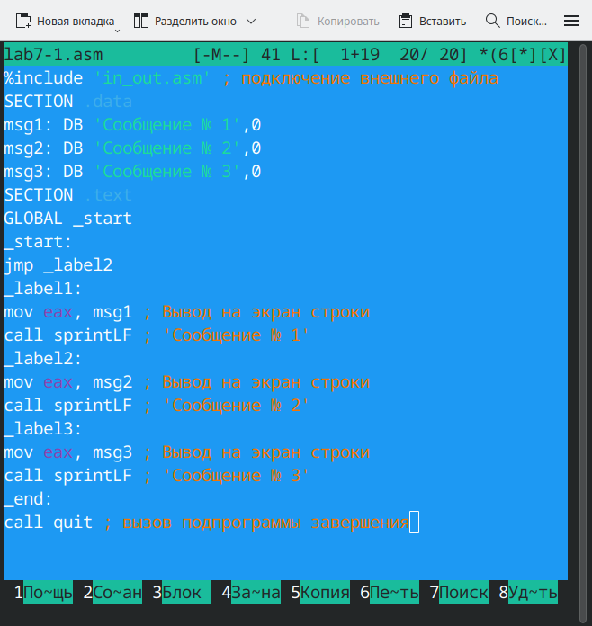{#fig:2.png width=0.7\textwidth}


Затем я создала исполняемый файл и запустила его (Рисунок 2.3).
Для корректной работы программы скопировала файл in_out.asm в каталог с файлом lab7-1.asm.

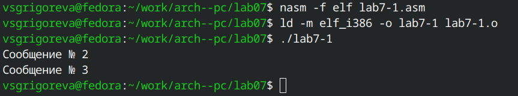{#fig:3.png width=0.7\textwidth}

Программа корректно вывела значения и завершила работу.

Использование инструкции jmp _label2 меняет порядок исполнения
инструкций и позволяет выполнить инструкции начиная с метки _label2, пропустив вывод первого сообщения.

Инструкция jmp позволяет осуществлять переходы не только вперед но и назад. Далее я изменила программу таким образом, чтобы она выводила сначала ‘Сообщение № 2’, потом ‘Сообщение
№ 1’ и завершала работу (Рисунок 2.4). 

```nasm 
%include 'in_out.asm' ; подключение внешнего файла
SECTION .data
msg1: DB 'Сообщение № 1',0
msg2: DB 'Сообщение № 2',0
msg3: DB 'Сообщение № 3',0
SECTION .text
GLOBAL _start
_start:
jmp _label2
_label1:
mov eax, msg1 ; Вывод на экран строки
call sprintLF ; 'Сообщение № 1'
jmp _end
_label2:
mov eax, msg2 ; Вывод на экран строки
call sprintLF ; 'Сообщение № 2'
jmp _label1
_label3:
mov eax, msg3 ; Вывод на экран строки
call sprintLF ; 'Сообщение № 3'
_end:
call quit ; вызов подпрограммы завершения
```

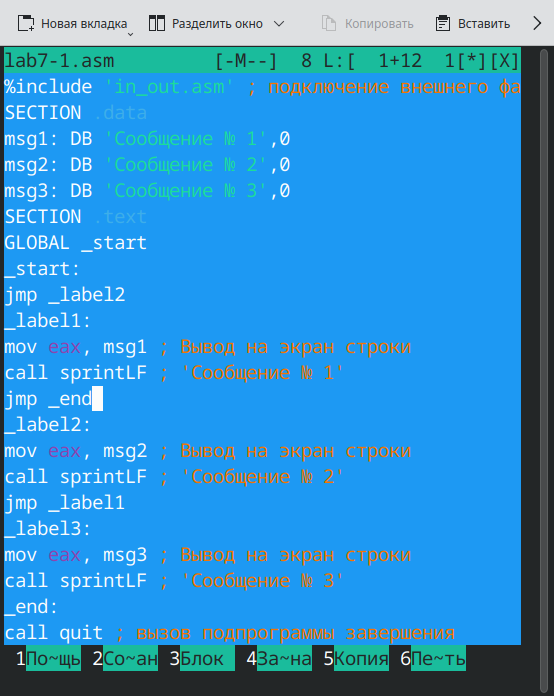{#fig:4.png width=0.7\textwidth}

Затем я создала исполняемый файл и проверила его работу (Рисунок 2.5).

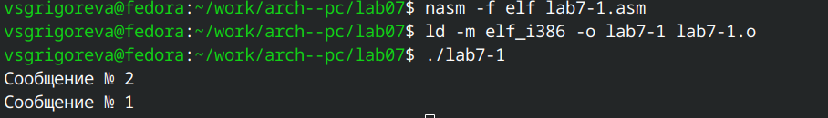{#fig:5.png width=0.7\textwidth}

Программ корректно вывела сообщения и завершила работу.

Затем я изменила текст программы таким образом, чтобы она выводила сначала Сообщение №3, потом №2 и №1 (Рисунок 2.6).

```nasm 
%include 'in_out.asm' ; подключение внешнего файла
SECTION .data
msg1: DB 'Сообщение № 1',0
msg2: DB 'Сообщение № 2',0
msg3: DB 'Сообщение № 3',0
SECTION .text
GLOBAL _start
_start:
jmp _label3
_label1:
mov eax, msg1 ; Вывод на экран строки
call sprintLF ; 'Сообщение № 1'
jmp _end
_label2:
mov eax, msg2 ; Вывод на экран строки
call sprintLF ; 'Сообщение № 2'
jmp _label1
_label3:
mov eax, msg3 ; Вывод на экран строки
call sprintLF ; 'Сообщение № 3'
jmp _label2
_end:
call quit ; вызов подпрограммы завершения
```

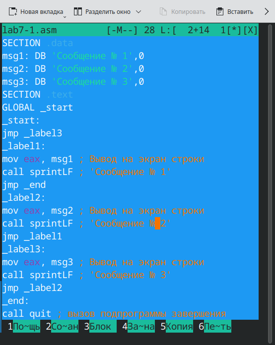{#fig:6.png width=0.7\textwidth}

Далее я создала исполняемый файл и запустила программу (Рисунок 2.7). Программа корректно выполнила работу.

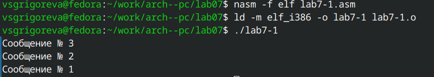{#fig:7.png width=0.7\textwidth}

Часто при написании программ необходимо использовать условные переходы, т.е. переход должен происходить если выполнено какое-либо условие. Я создала файл lab7-2.asm в каталоге ~/work/arch-pc/lab07 (Рисунок 2.8) и ввела в него текст из листинга 4 (Рисунок 2.9).

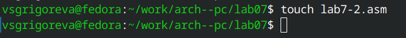{#fig:8.png width=0.7\textwidth}

```nasm 
%include 'in_out.asm'
section .data
msg1 db 'Введите B: ',0h
msg2 db "Наибольшее число: ",0h
A dd '20'
C dd '50'
section .bss
max resb 10
B resb 10
section .text
global _start
_start:
; ---------- Вывод сообщения 'Введите B: '
mov eax,msg1
call sprint
; ---------- Ввод 'B'
mov ecx,B
mov edx,10
call sread
; ---------- Преобразование 'B' из символа в число
mov eax,B
call atoi ; Вызов подпрограммы перевода символа в число
mov [B],eax ; запись преобразованного числа в 'B'
; ---------- Записываем 'A' в переменную 'max'
mov ecx,[A] ; 'ecx = A'
mov [max],ecx ; 'max = A'
; ---------- Сравниваем 'A' и 'С' (как символы)
cmp ecx,[C] ; Сравниваем 'A' и 'С'
jg check_B ; если 'A>C', то переход на метку 'check_B',
mov ecx,[C] ; иначе 'ecx = C'
mov [max],ecx ; 'max = C'
; ---------- Преобразование 'max(A,C)' из символа в число
check_B:
mov eax,max
call atoi ; Вызов подпрограммы перевода символа в число
mov [max],eax ; запись преобразованного числа в `max`
; ---------- Сравниваем 'max(A,C)' и 'B' (как числа)
mov ecx,[max]
cmp ecx,[B] ; Сравниваем 'max(A,C)' и 'B'
jg fin ; если 'max(A,C)>B', то переход на 'fin',
mov ecx,[B] ; иначе 'ecx = B'
mov [max],ecx
; ---------- Вывод результата
fin:
mov eax, msg2
call sprint ; Вывод сообщения 'Наибольшее число: '
mov eax,[max]
call iprintLF ; Вывод 'max(A,B,C)'
call quit ; Выход
```

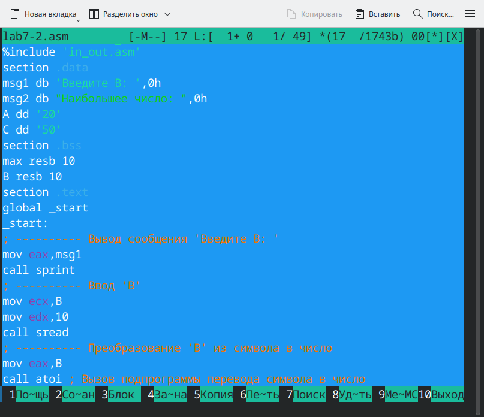{#fig:9.png width=0.7\textwidth}

Затем я создала исполняемый фал и проверила работу для нескольких значений B (Рисунок 2.10).

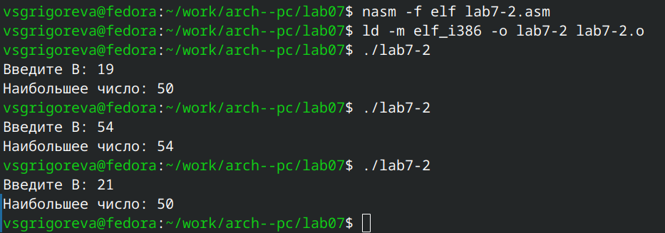{#fig:10.png width=0.7\textwidth}

Программа корректно вывела значения для всех введенных В и завершила работу.

## Изучение структуры файлы листинга

Обычно nasm создаёт в результате ассемблирования только объектный файл. Получить файл листинга можно, указав ключ -l и задав имя файла листинга в командной строке. Я создала файл листинга для программы из файла lab7-2.asm (Рисунок 2.11).

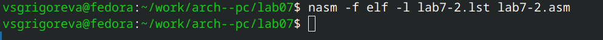{#fig:11.png width=0.7\textwidth}

Затем я открыла файл листинга lab7-2.lst с помощью mcedit (Рисунок 2.12).
 
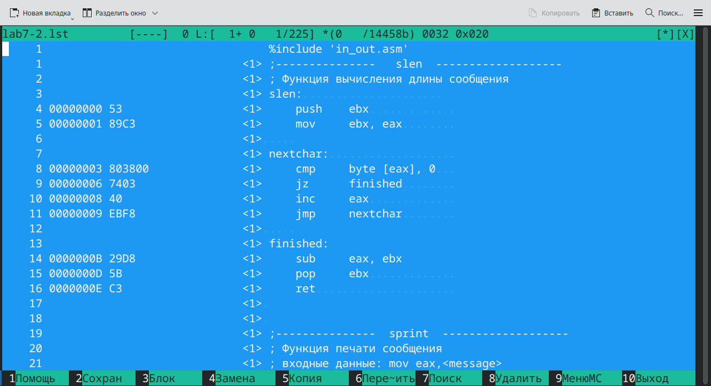{#fig:12.png width=0.7\textwidth}

Я внимательно ознакомилась с его форматом и содержимым. 

Например, в строке '00000003 803800              <1>     cmp     byte [eax], 0' инструкция сравнивает байт по адресу, хранящемуся в регистре EAX, с нулём. Используется для проверки конца строки в функции вычисления длины строки. Машинный код 80 38 00 представляет команду cmp r/m8, imm8.

В строке '00000013 E8E8FFFFFF          <1>     call    slen' команда call вызывает подпрограмму slen, передавая управление по относительному смещению, указанному в машинном коде E8 E8 FF FF FF. Перед переходом процессор сохраняет адрес возврата в стек. Эта функция используется для вычисления длины строки перед её выводом.

Cтрока '00000000 D092D0B2D0B5D0B4D0-     msg1 db 'Введите B: ',0h' определяет в сегменте .data текстовое сообщение «Введите B: », закодированное в UTF-8, что видно из двубайтных последовательностей вида D0 92, D0 B2 и т. д. Директива db размещает эти байты в памяти, а 0h добавляет нулевой терминатор для корректной работы функций обработки строк.

Затем я открыла файл с программой lab7-2.asm и в одной инструкции удалила один операнд. Выполнила трансляцию с получением файла листинга (Рисунок 2.13).

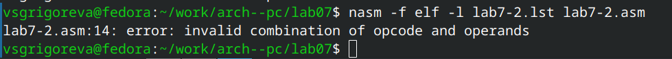{#fig:14.png width=0.7\textwidth}

В этом случае создается файл с листингом lab7-2.lst, при этом в тексте листинга в строке, из который был удален операнд, появляется ошибка (Рисунок 2.14).

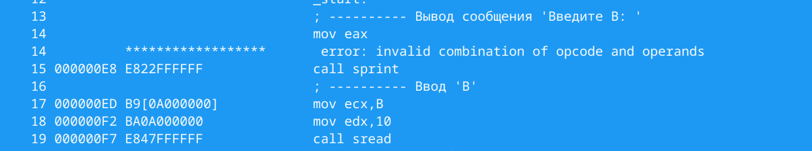{#fig:15.png width=0.7\textwidth}

# Задание для самостоятельной работы

1. Написала программу нахождения наименьшей из 3 целочисленных переменных a, b, c. Значения переменных выбрала из таблицы в соответствии с вариантом, полученным в предыдущей лабораторной работе (вар. 15 a=32, b=6, c=54). 

```nasm 
%include 'in_out.asm'

SECTION .data
A dd 32
B dd 6
C dd 54
msg DB 'Наименьшее из A,B,C: ',0

SECTION .bss
minv RESD 1

SECTION .text
GLOBAL _start

_start:
    ; Сначала min = A
    mov eax, [A]
    mov [minv], eax

    ; сравнение min и B
    cmp eax, [B]
    jle check_C
    mov eax, [B]
    mov [minv], eax

check_C:
    cmp eax, [C]
    jle print_min
    mov eax, [C]
    mov [minv], eax

print_min:
    mov eax, msg
    call sprint
    mov eax, [minv]
    call iprintLF

    call quit
```

Затем создала исполняемый файл и проверила его работу (Рисунок 2.15).

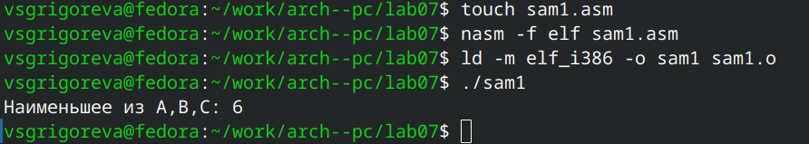{#fig:16.png width=0.7\textwidth}

Программа корректно вывела наименьшее значение.

2. Я написала программу, которая для введенных с клавиатуры значений 𝑥 и 𝑎 вычисляет значение заданной функции 𝑓(𝑥) и выводит результат вычислений. Вид функции 𝑓(𝑥) выбрала в соответствии с вариантом, полученным в предыдущей лабораторной работе (𝑎 + 10, 𝑥 < 𝑎 и 𝑥 + 10, 𝑥 ≥ 𝑎).

```nasm 
%include 'in_out.asm'

SECTION .data
msg_x   DB 'Введите x: ',0
msg_a   DB 'Введите a: ',0
msg_res DB 'Результат f(x): ',0

SECTION .bss
bufx RESB 80
bufa RESB 80
valx RESD 1
vala RESD 1

SECTION .text
GLOBAL _start

_start:
    ; Ввод x
    mov eax, msg_x
    call sprint
    mov ecx, bufx
    mov edx, 80
    call sread

    ; Ввод a
    mov eax, msg_a
    call sprint
    mov ecx, bufa
    mov edx, 80
    call sread

    ; преобразование x -> число
    mov eax, bufx
    call atoi
    mov [valx], eax

    ; преобразование a -> число
    mov eax, bufa
    call atoi
    mov [vala], eax

    ; условие: if x < a -> result = a + 10
    mov eax, [valx]    ; eax = x
    cmp eax, [vala]    ; compare x, a
    jl  less_than_a

    ; ветвь x >= a: result = x + 10
    mov eax, [valx]
    add eax, 10
    jmp print_result

less_than_a:
    mov eax, [vala]
    add eax, 10

print_result:
    ; печать результата
    mov edi, eax
    mov eax, msg_res
    call sprint
    mov eax, edi
    call iprintLF

    call quit
```

Далее я создала исполняемый файл и проверила его работу для значений 𝑥 и 𝑎 (Рисунок 2.16).

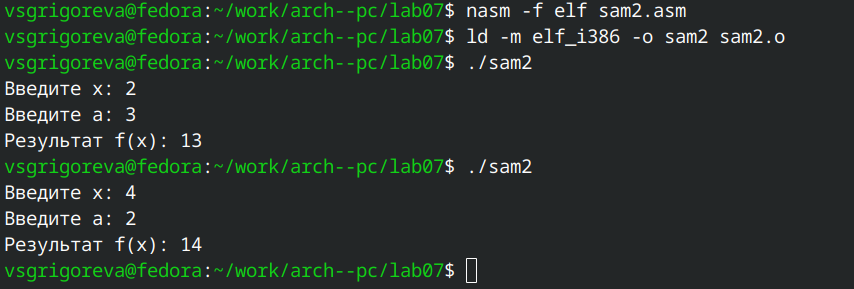{#fig:17.png width=0.7\textwidth}

Программа корректно вывела результаты для разных значений x и a.

# Вывод

В ходе выполнения работы я изучила команды условного и безусловного переходов, приобрела навыки написания программ с использованием переходов, познакомилась с назначением и структурой файла листинга.
