---
## Front matter
title: "Отчёт по лабораторной работе №8"
subtitle: "Выполнила студентка НКАбд-02-25"
author: "Валерия Сергеевна Григорьева"

## Generic otions
lang: ru-RU
toc-title: "Содержание"

## Bibliography
bibliography: bib/cite.bib
csl: pandoc/csl/gost-r-7-0-5-2008-numeric.csl

## Pdf output format
toc: true # Table of contents
toc-depth: 2
lof: false # List of figures
lot: false # List of tables
fontsize: 12pt
linestretch: 1.5
papersize: a4
documentclass: scrreprt
## I18n polyglossia
polyglossia-lang:
  name: russian
  options:
  - spelling=modern
  - babelshorthands=true
polyglossia-otherlangs:
  name: english
## I18n babel
babel-lang: russian
babel-otherlangs: english
## Fonts
mainfont: "Liberation Serif"
romanfont: "Liberation Serif"
sansfont: "Liberation Sans"
monofont: "Liberation Mono"
mainfontoptions: Ligatures=TeX
romanfontoptions: Ligatures=TeX
sansfontoptions: Ligatures=TeX,Scale=MatchLowercase
monofontoptions: Scale=MatchLowercase,Scale=0.9
## Biblatex
biblatex: true
biblio-style: "gost-numeric"
biblatexoptions:
  - parentracker=true
  - backend=biber
  - hyperref=auto
  - language=auto
  - autolang=other*
  - citestyle=gost-numeric
## Pandoc-crossref LaTeX customization
figureTitle: "Рис."
tableTitle: "Таблица"
listingTitle: "Листинг"
lofTitle: "Порядок проведения лабораторной работы"
lotTitle: "Вывод"
lolTitle: "Листинги"
## Misc options
indent: true
header-includes:
  - \usepackage{indentfirst}
  - \usepackage{float} # keep figures where there are in the text
  - \floatplacement{figure}{H} # keep figures where there are in the text
---
# Цель работы
Цель данной работы - приобретение навыков написания программ с использованием циклов и обработкой аргументов командной строки

# Порядок выполнения лабораторной работы

## Реализация переходов в NASM
Для начала работы я создала каталог для лабораторной работы №8, перешла в него и создала файл lab8-1.asm (Рисунок 2.1).

{#fig:1.png width=0.7\textwidth}

Затем я ввела в файл lab8-1.asm текст программы из листинга 1 (Рисунок 2.2).

```nasm
;-----------------------------------------------------------------
; Программа вывода значений регистра 'ecx'
;-----------------------------------------------------------------
%include 'in_out.asm'
SECTION .data
	msg1 db 'Введите N: ',0h

SECTION .bss
	N: resb 10

SECTION .text
	global _start
_start:

; ----- Вывод сообщения 'Введите N: '
	mov eax,msg1
	call sprint

; ----- Ввод 'N'
	mov ecx, N
	mov edx, 10
	call sread

; ----- Преобразование 'N' из символа в число
	mov eax,N
	call atoi
	mov [N],eax

; ------ Организация цикла
	mov ecx,[N] ; Счетчик цикла, `ecx=N`
label:
	mov [N],ecx
	mov eax,[N]
	call iprintLF ; Вывод значения `N`
	loop label ; `ecx=ecx-1` и если `ecx` не '0'
					; переход на `label`

call quit
```

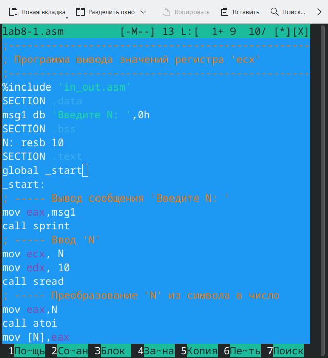{#fig:2.png width=0.7\textwidth}


Затем я создала исполняемый файл и запустила его (Рисунок 2.3).
Для корректной работы программы скопировала файл in_out.asm в каталог с файлом lab8-1.asm.

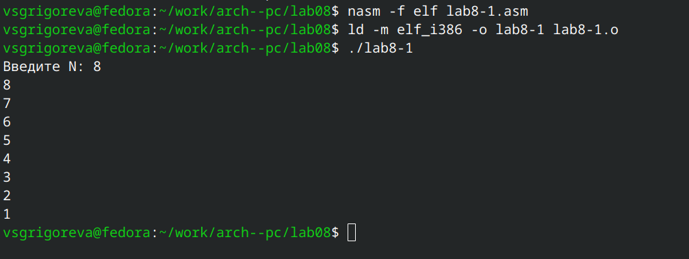{#fig:3.png width=0.7\textwidth}


Данный пример показывает, что использование регистра ecx в теле цилка loop может привести к некорректной работе программы. 

Далее я изменила текст программы, обавив изменение значение регистра ecx в цикле (Рисунок 2.4):

```nasm
label:
	sub ecx,1 ; `ecx=ecx-1`
	mov [N],ecx
	mov eax,[N]
	call iprintLF
	loop label
```

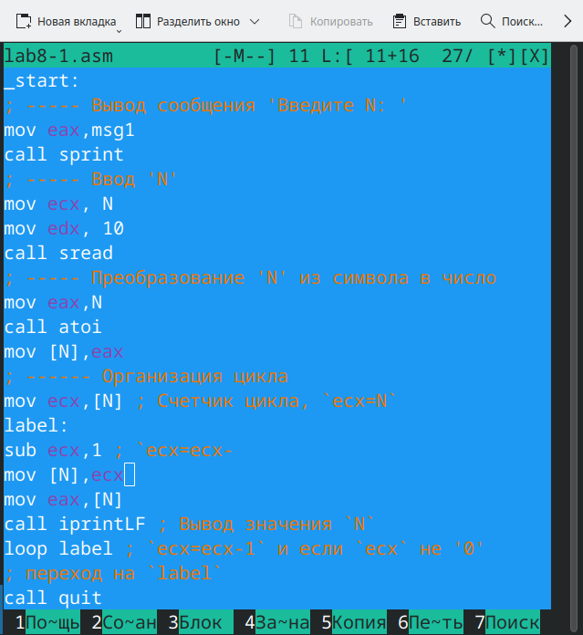{#fig:4.png width=0.7\textwidth}

Затем я создала исполняемый файл и запустила его (Рисунок 2.5).

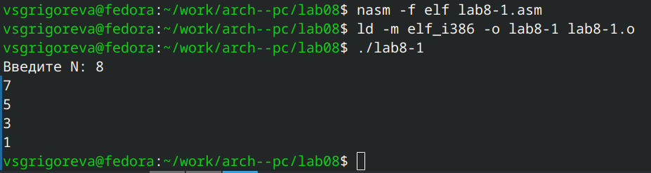{#fig:5.png width=0.7\textwidth}

Регистр ecx принимает значения, которые уменьшаются дважды за одну итерацию. Число проходов не соответствует числу N.

Для использования регистра ecx в цикле и сохранения корректности работы программы можно использовать стек. Я внесла изменения в текст программы, добавив команды push и pop (добавления в стек и извлечения из стека) для сохранения значения счетчика цикла loop (Рисунок 2.6):

```nasm 
label:
	push ecx ; добавление значения ecx в стек
	sub ecx,1
	mov [N],ecx
	mov eax,[N]
	call iprintLF
	pop ecx ; извлечение значения ecx из стека

	loop label
```

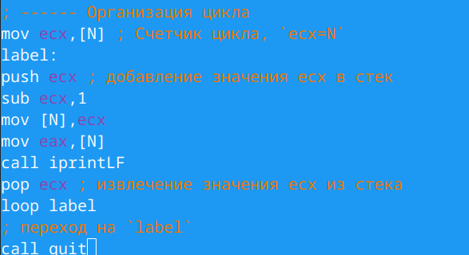{#fig:6.png width=0.7\textwidth}

Затем я создала исполняемый файл и запустила его (Рисунок 2.7).

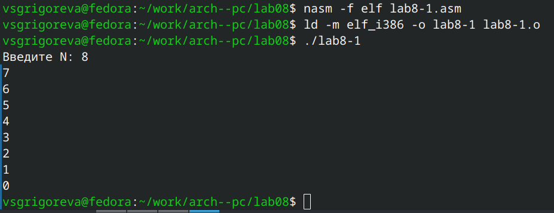{#fig:8.png width=0.7\textwidth}

В данном случае число проходов цикла соответсвтует значению N, введенному с клавиатуры.

## Oбработка аргументов командной строки

Для начала работы я создала файл lab8-2.asm в каталоге ~/work/arch-pc/lab08 (Рисунок 2.8). 

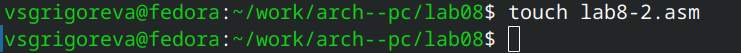{#fig:9.png width=0.7\textwidth}

Затем я ввела в него текст программы из листинга 8.2 (Рисунок 2.9).

```nasm 
;-----------------------------------------------------------------
; Обработка аргументов командной строки
;-----------------------------------------------------------------

%include 'in_out.asm'

SECTION .text

global _start

_start:
	pop ecx ; Извлекаем из стека в `ecx` количество
		; аргументов (первое значение в стеке)
	pop edx ; Извлекаем из стека в `edx` имя программы
		; (второе значение в стеке)
	sub ecx, 1 ; Уменьшаем `ecx` на 1 (количество
		; аргументов без названия программы)

next:
	cmp ecx, 0 ; проверяем, есть ли еще аргументы
	jz _end ; если аргументов нет выходим из цикла
		; (переход на метку `_end`)
	pop eax ; иначе извлекаем аргумент из стека
	call sprintLF ; вызываем функцию печати
	loop next ; переход к обработке следующего
		; аргумента (переход на метку `next`)

_end:
	call quit
```

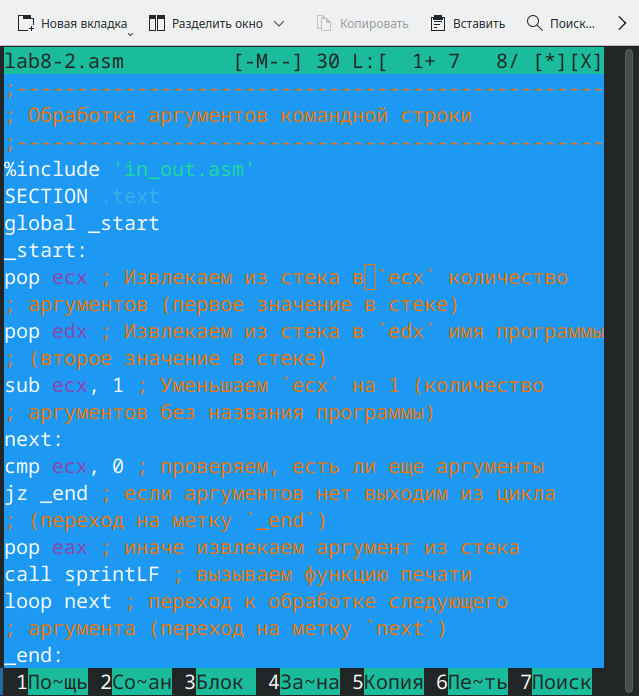{#fig:10.png width=0.7\textwidth}

Затем я создала исполняемый файл и запустила его (Рисунок 2.10).

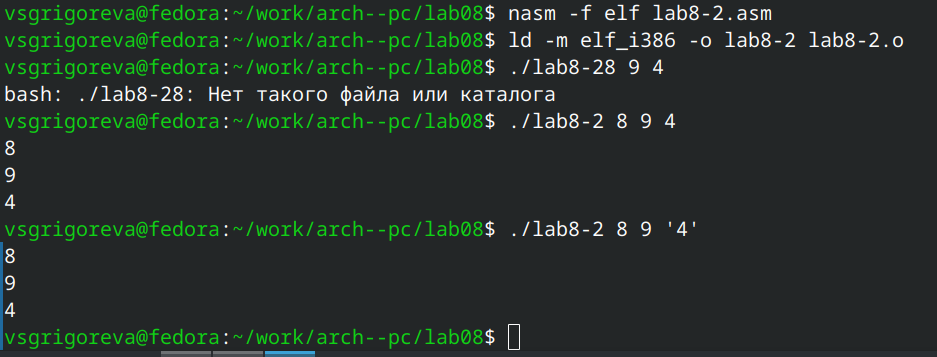{#fig:11.png width=0.7\textwidth}

Программой было обработано 3 аргумента.

Затем я создала файл lab8-3.asm в каталоге ~/work/arch-pc/lab08 и ввела в него текст программы из листинга 8.3 (Рисунок 2.11).

```nasm 
%include 'in_out.asm'

SECTION .data
msg db "Результат: ",0

SECTION .text
global _start

_start:
	pop ecx ; Извлекаем из стека в `ecx` количество
		; аргументов (первое значение в стеке)
	pop edx ; Извлекаем из стека в `edx` имя программы
		; (второе значение в стеке)
	sub ecx,1 ; Уменьшаем `ecx` на 1 (количество
		; аргументов без названия программы)
	mov esi, 0 ; Используем `esi` для хранения
		; промежуточных сумм

next:
	cmp ecx,0h ; проверяем, есть ли еще аргументы
	jz _end ; если аргументов нет выходим из цикла
		; (переход на метку `_end`)
	pop eax ; иначе извлекаем следующий аргумент из стека
	call atoi ; преобразуем символ в число
	add esi,eax ; добавляем к промежуточной сумме
		; след. аргумент `esi=esi+eax`
	loop next ; переход к обработке следующего аргумента

_end:
	mov eax, msg ; вывод сообщения "Результат: "
	call sprint
	mov eax, esi ; записываем сумму в регистр `eax`
	call iprintLF ; печать результата
	call quit ; завершение программы
```

{#fig:13.png width=0.7\textwidth}

Затем я создала исполняемый файл и запустила его (Рисунок 2.12).

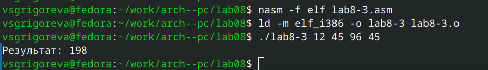{#fig:14.png width=0.7\textwidth}

Далее я изменила текст программы из листинга 8.3 для вычисления произведения аргументов командной строки (Рисунок 2.13).

```nasm 
%include 'in_out.asm'
SECTION .data
msg db "Результат: ",0
SECTION .text
global _start
_start:
pop ecx ; Извлекаем из стека в `ecx` количество
; аргументов (первое значение в стеке)
pop edx ; Извлекаем из стека в `edx` имя программы
; (второе значение в стеке)
sub ecx,1 ; Уменьшаем `ecx` на 1 (количество
; аргументов без названия программы)
mov esi, 1 ; Используем `esi` для хранения
; промежуточных сумм
next:
cmp ecx,0h ; проверяем, есть ли еще аргументы
jz _end ; если аргументов нет выходим из цикла
; (переход на метку `_end`)
pop eax ; иначе извлекаем следующий аргумент из стека
call atoi ; преобразуем символ в число
imul esi,eax ; 
loop next ; переход к обработке следующего аргумента
_end:
mov eax, msg ; вывод сообщения "Результат: "
call sprint
mov eax, esi ; записываем сумму в регистр `eax`
call iprintLF ; печать результата
call quit ; завершение программы
```

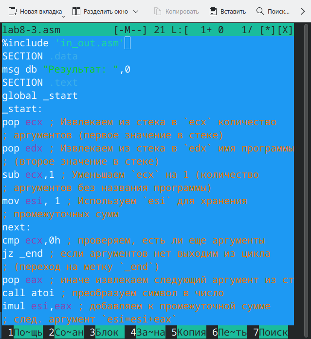{#fig:15.png width=0.7\textwidth}

Затем я создала исполняемый файл и запустила его (Рисунок 2.14).

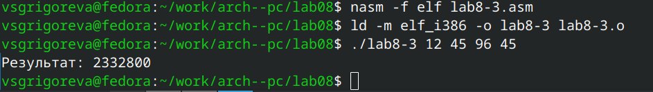{#fig:16.png width=0.7\textwidth}

# Задание для самостоятельной работы

Я написала программу, которая находит сумму значений функции 𝑓(𝑥) для 𝑥 = 𝑥1, 𝑥2, ..., 𝑥𝑛, т.е. программа должна выводить значение 𝑓(𝑥1) + 𝑓(𝑥2) + ... + 𝑓(𝑥𝑛). Значения 𝑥𝑖 передаются как аргументы. Вид функции 𝑓(𝑥)=6*x+13. (Рисунок 3.1)

```nasm 
%include 'in_out.asm'

SECTION .data
msg_func    db 'Функция: f(x)=6*x+13',0h
msg_res     db 'Результат: ',0h

SECTION .text
global _start
_start:
    ; Стек при входе (NASM): ... arg_n, ..., arg_1, argv0, argc
    pop ecx          ; ecx := argc
    pop edx          ; edx := argv0 (имя программы)
    sub ecx, 1       ; ecx := кол-во реальных аргументов (без имени программы)

    mov esi, 0       ; esi — накопитель суммы (32-bit)

    cmp ecx, 0
    jz .print_result

.loop_args:
    pop eax          ; eax := адрес очередного аргумента (строка)
    push ecx         ; сохранить ecx (atoi/подпрограммы могут изменить ecx)
    call atoi        ; преобразование строки (по адресу в eax) -> result в eax
                     ; теперь eax = числовое значение x
    pop ecx          ; восстановить ecx

    imul eax, 6      ; eax = eax * 6
    add eax, 13      ; eax = eax + 13  => eax = f(x)

    add esi, eax     ; esi += f(x)

    loop .loop_args  ; dec ecx; если !=0 -> переход к .loop_args

.print_result:
    mov eax, msg_func
    call sprintLF

    mov eax, msg_res
    call sprint

    mov eax, esi     ; результат в eax
    call iprintLF    ; печать результата с переводом строки

    call quit

```

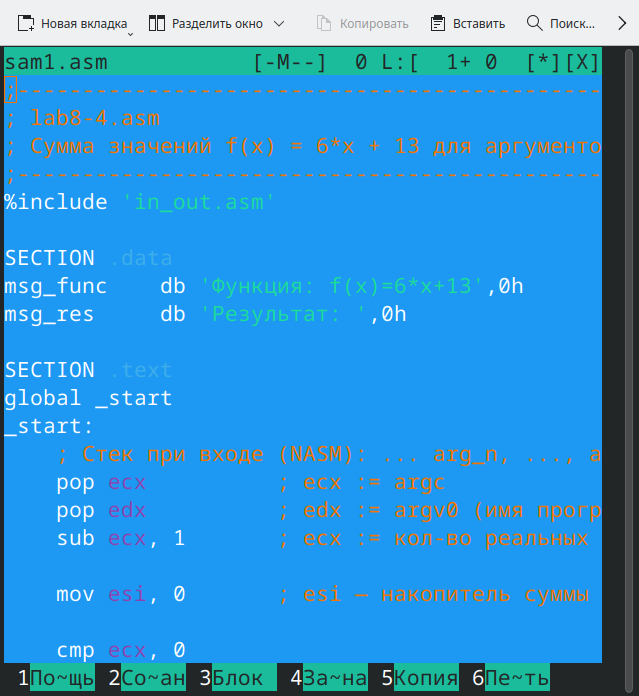{#fig:17.png width=0.7\textwidth}

Затем я создала исполняемый файл и проверила его работу на
нескольких наборах 𝑥 = 𝑥1, 𝑥2, ..., 𝑥𝑛 (Рисунок 3.2).

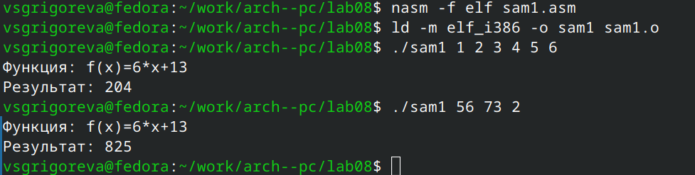{#fig:18.png width=0.7\textwidth}

Программа корректно вывела значение и закончила работу.

# Вывод

В ходе выполнения лабораторной работы я приобрела навыки написания программ с использованием циклов и обработкой аргументов командной строки.
