---
## Front matter
title: "Отчёт по лабораторной работе №9"
subtitle: "Выполнила студентка НКАбд-02-25"
author: "Валерия Сергеевна Григорьева"

## Generic otions
lang: ru-RU
toc-title: "Содержание"

## Bibliography
bibliography: bib/cite.bib
csl: pandoc/csl/gost-r-7-0-5-2008-numeric.csl

## Pdf output format
toc: true # Table of contents
toc-depth: 2
lof: false # List of figures
lot: false # List of tables
fontsize: 12pt
linestretch: 1.5
papersize: a4
documentclass: scrreprt
## I18n polyglossia
polyglossia-lang:
  name: russian
  options:
  - spelling=modern
  - babelshorthands=true
polyglossia-otherlangs:
  name: english
## I18n babel
babel-lang: russian
babel-otherlangs: english
## Fonts
mainfont: "Liberation Serif"
romanfont: "Liberation Serif"
sansfont: "Liberation Sans"
monofont: "Liberation Mono"
mainfontoptions: Ligatures=TeX
romanfontoptions: Ligatures=TeX
sansfontoptions: Ligatures=TeX,Scale=MatchLowercase
monofontoptions: Scale=MatchLowercase,Scale=0.9
## Biblatex
biblatex: true
biblio-style: "gost-numeric"
biblatexoptions:
  - parentracker=true
  - backend=biber
  - hyperref=auto
  - language=auto
  - autolang=other*
  - citestyle=gost-numeric
## Pandoc-crossref LaTeX customization
figureTitle: "Рис."
tableTitle: "Таблица"
listingTitle: "Листинг"
lofTitle: "Порядок проведения лабораторной работы"
lotTitle: "Вывод"
lolTitle: "Листинги"
## Misc options
indent: true
header-includes:
  - \usepackage{indentfirst}
  - \usepackage{float} # keep figures where there are in the text
  - \floatplacement{figure}{H} # keep figures where there are in the text
---
# Цель работы
Цель данной работы - приобретение навыков написания программ с использованием подпрограмм, знакомство с методами отладки при помощи GDB и его основными возможностями.

# Порядок выполнения лабораторной работы

## Реализация подпрограмм в NASM

Для начала работы я создала каталог для лабораторной работы №9, перешла в него и создала файл lab9-1.asm (Рисунок 2.1).

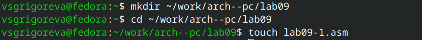{#fig:1.png width=0.7\textwidth}

Затем я внимательно изучила текст листинга 9.1 и ввела его в файл lab8-1.asm. В данной программе вычисляется арифметическое выраженияе f(x) = 2х + 7 с помощью подпрограммы _calcul. Далее создала исполняемый файл и запустила его (Рисунок 2.2). 
Для корректной работы программы скопировала файл in_out.asm в каталог с файлом lab9-1.asm.

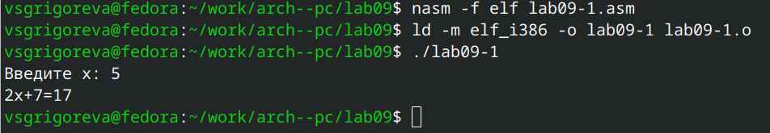{#fig:2.png width=0.7\textwidth}

Программа корректно выполнила свою работу и завершила ее.
Затем я изменила текст программы, добавив подпрограмму _subcalcul в подпрограмму _calcul, для вычисления выражения f(g(x)), где g(x) = 3x - 1 (Рисунок 2.3).

```nasm
%include 'in_out.asm'

SECTION .data
    msg: DB 'Введите x: ',0
    result: DB '2x+7=',0

SECTION .bss
    x: RESB 80
    res: RESB 80

SECTION .text
GLOBAL _start
    _start:
;------------------------------------------
; Основная программа
;------------------------------------------

    mov eax, msg
    call sprint
    
    mov ecx, x
    mov edx, 80
    call sread

    mov eax,x
    call atoi

    call _calcul ; Вызов подпрограммы _calcul
    mov eax,result
    call sprint
    mov eax,[res]
    call iprintLF

    call quit
;------------------------------------------
; Подпрограмма вычисления
; выражения "f(g(x)) = 2x+7"; 

    _calcul:
	call _subcalcul
	mov ebx,2
	mul ebx
	add eax,7
	mov [res],eax
	ret ; выход из подпрограммы
;------------------------------------------
; Подпрограмма вычисления
; выражения "g(x) = 3x-1"
;------------------------------------------
_subcalcul:
mov ebx, 3
mul ebx               ; eax = 3 * x
sub eax, 1
ret
```

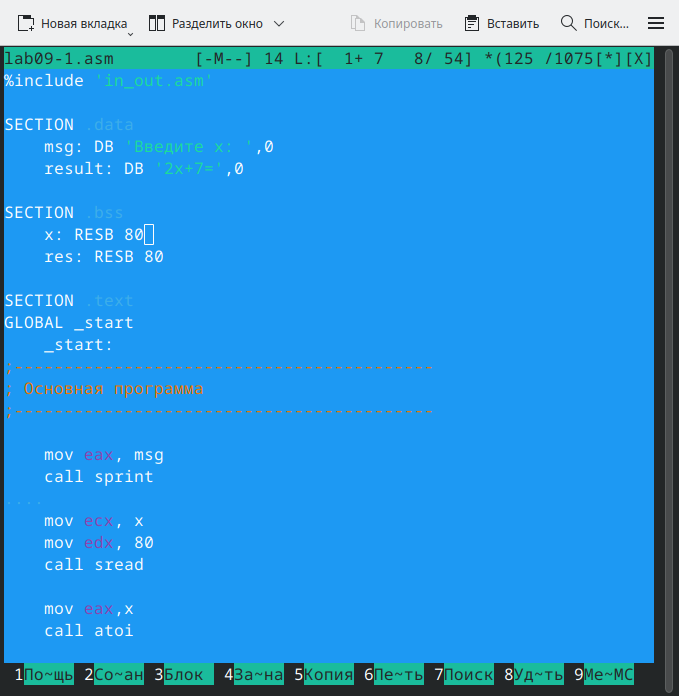{#fig:3.png width=0.7\textwidth}

Далее я создала исполняемый файл и запустила его (Рисунок 2.4). 

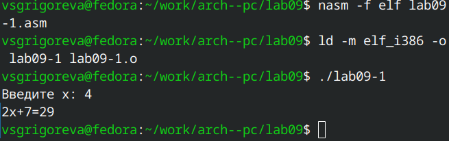{#fig:4.png width=0.7\textwidth}

Программа корректно посчитала значение и завершила работу.

## Отладка программам с помощью GDB

Для начала работы я создала файл lab9-2.asm в каталоге ~/work/arch-pc/lab08 (Рисунок 2.5). 

{#fig:5.png width=0.7\textwidth}

Затем я ввела в него текст программы из листинга 9.2 (Программа печати сообщения Hello world!) (Рисунок 2.6).

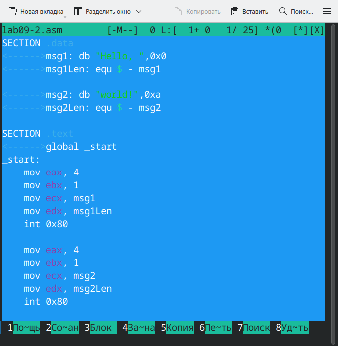{#fig:6.png width=0.7\textwidth}

Далее я создала исполняемый файл, при этом добавив ключ '-g' (Рисунок 2.7).

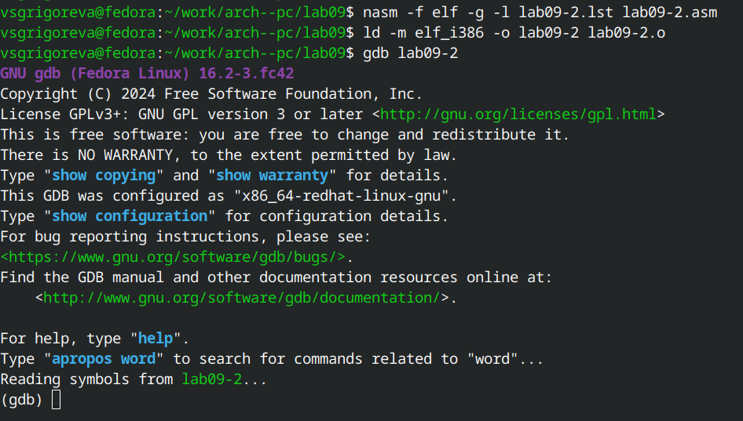{#fig:7.png width=0.7\textwidth}

Далее я проверила работу программы, запустив ее в оболочке GDB с помощью команды run (Рисунок 2.8).

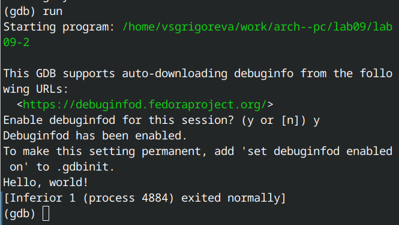{#fig:8.png width=0.7\textwidth}

Для более подробного анализа программы установиkf брейкпоинт на метку _start и запустила её (Рисунок 2.9).

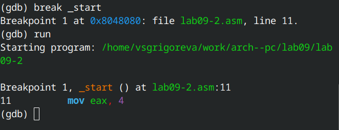{#fig:9.png width=0.7\textwidth}

C помощью команды disassemble я посмотрела дисассимилированный код программы (Рисунок 2.10).

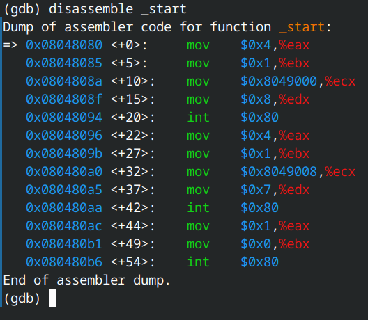{#fig:10.png width=0.7\textwidth}

Затем переключилась на отображение команд с Intel’овским синтаксисом (Рисунок 2.11).

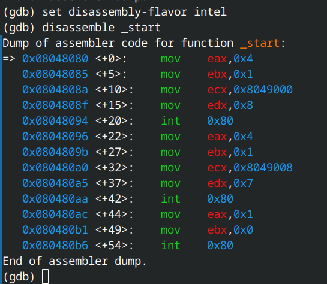{#fig:11.png width=0.7\textwidth}

Различия отображения синтаксиса машинных команд в режимах ATT и Intel. В Intel-синтаксисе операнды идут в порядке dst, src (например, mov eax, 0x4), регистры пишутся без %. В ATT-синтаксисе обратный порядок src, dst (mov $0x4, %eax), используются префиксы % для регистров и $ для констант.

Далее я включила режим псевдографики для более удобного анализа программы (Рисунок 2.12).

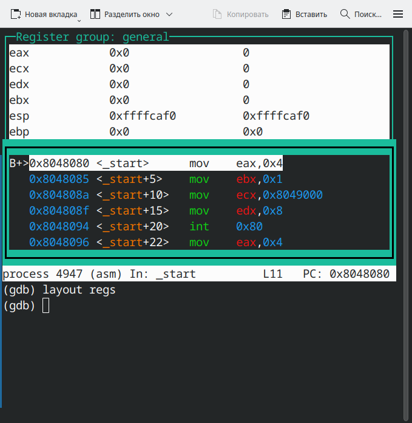{#fig:13.png width=0.7\textwidth}

### Добавление точек останова

С помощью команды info breakpoints я проверила точку останова по имени метки (_start), установленную на предыдущих шагах (Рисунок 2.13).

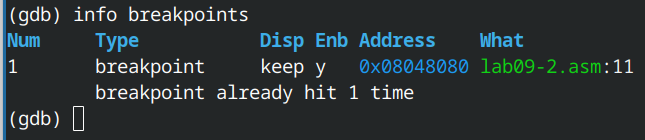{#fig:14.png width=0.7\textwidth}

Точка действительно была установлена.
Затем я установила еще одну точку останова по адресу инструкции, определив адрес инструкции mov ebx,0x0 (Рисунок 2.14).

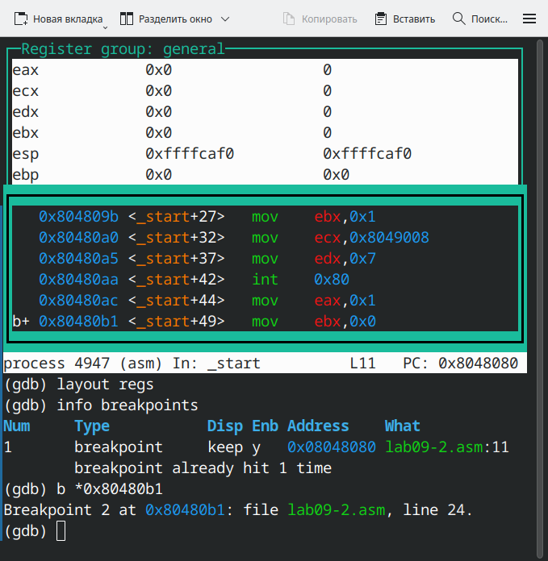{#fig:15.png width=0.7\textwidth}

Затем я еще раз посмотрела информацию о всех установленных точках останова (Рисунок 2.15). Точек останова теперь две.

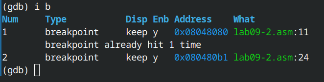{#fig:16.png width=0.7\textwidth}

### Работа с данными программы в GDB

Я выполнила 5 инструкций с помощью команды stepi (или si) и проследила за изменением значений регистров (Рисунок 2.16).
Значения регистров EAX, EBX, ECX и EDX изменяются.

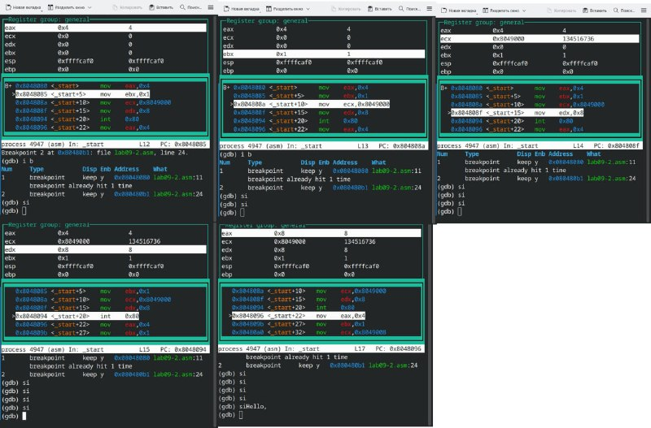{#fig:17.png width=0.7\textwidth}

Далее я посмотрела значение переменной msg1 по имени (Рисунок 2.17).

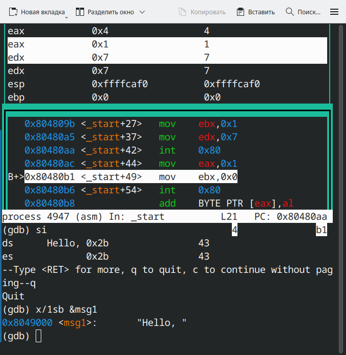{#fig:21.png width=0.7\textwidth}

А затем значение msg2 по адресу (Рисунок 2.18).

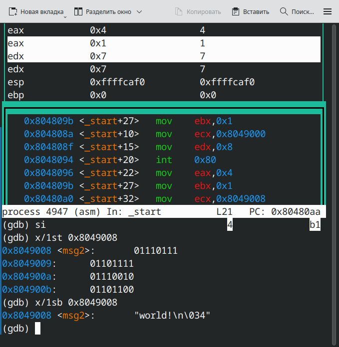{#fig:22.png width=0.7\textwidth}

Далее я изменила первый символ переменной msg1 и msg2 (Рисунок 2.19).

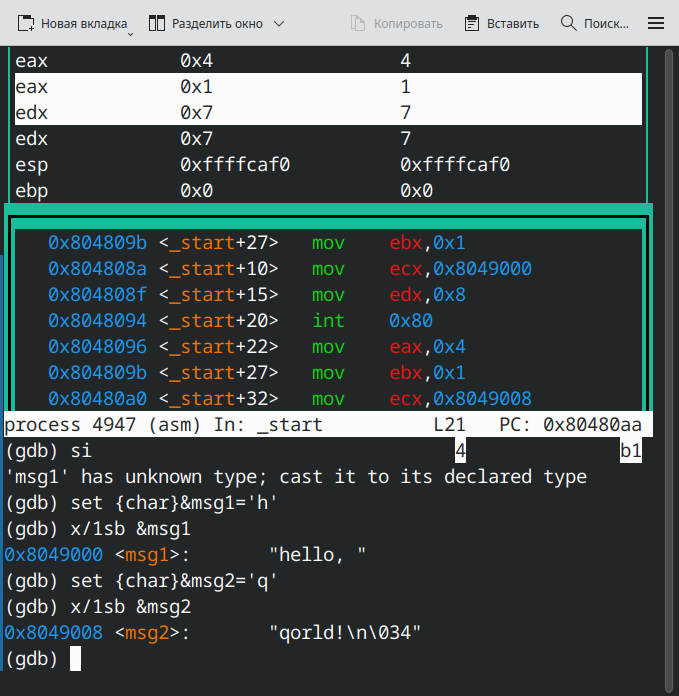{#fig:23.png width=0.7\textwidth}

Затем я с помощью команды set изменила значение регистра ebx (Рисунок 2.20). Команда p/s $ebx выводит строку по адресу, хранящемуся в ebx, поэтому при set $ebx='2' показывается ASCII-код символа, а при set $ebx=2 — числовое значение.

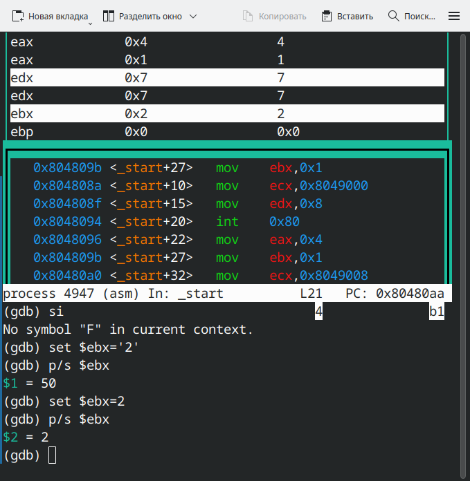{#fig:24.png width=0.7\textwidth}

В конце я завершила работу с помощью программы continue и  вышла из GDB с помощью команды quit (Рисунок 2.21).

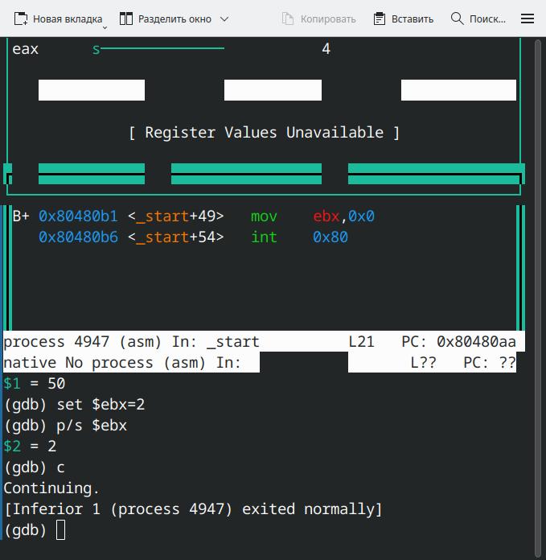{#fig:25.png width=0.7\textwidth}

### Обработка аргументов командной строки в GDB

Я скопировала файл lab8-2.asm, созданный при выполнении лабораторной работы №8, с программой выводящей на экран аргументы командной строки в файл с именем lab09-3.asm (Рисунок 2.22).

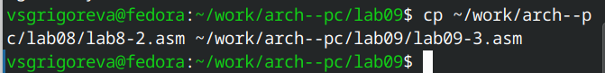{#fig:26.png width=0.7\textwidth}

Затем создала исполняемый файл и загрузила в откладчик, указав аргументы (Рисунок 2.23). 

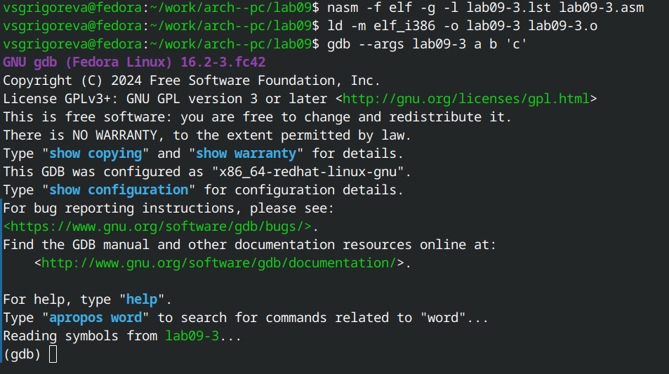{#fig:27.png width=0.7\textwidth}

Далее установила точку останова перед первой инструкцией в программе и запустила ее (Рисунок 2.24).

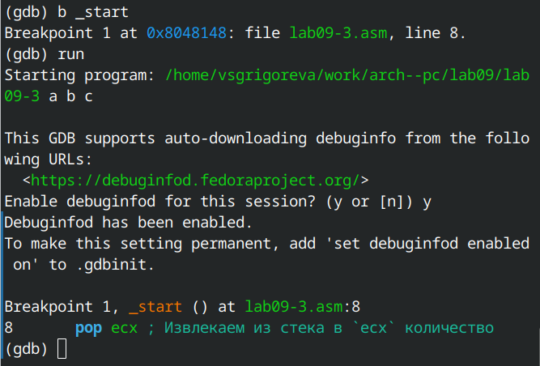{#fig:28.png width=0.7\textwidth}

Затем я посмотрела позиции стека: вершину и остальные по адесу [esp+4] (Рисунок 2.25). Шаг изменения адреса равен 4, так как в этой программе каждый адрес в памяти занимает 4 байта, и стек хранит обычный список адресов, а чтобы перейти к следующему адресу, нужно сдвинуться ровно на 4 байта.

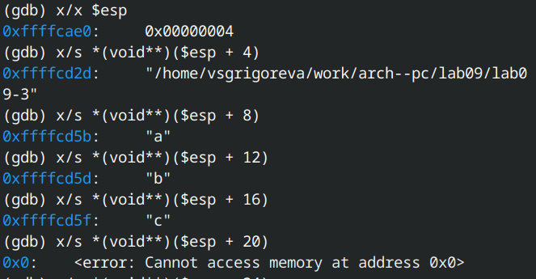{#fig:29.png width=0.7\textwidth}

# Задание для самостоятельной работы

1. Преобразуйте программу из лабораторной работы №8 (Задание №1 для самостоятельной работы), реализовав вычисление значения функции 𝑓(𝑥) как подпрограмму (Рисунок 3.1).

```nasm 
%include 'in_out.asm'

SECTION .data
msg_func    db 'Функция: f(x)=6*x+13',0h
msg_res     db 'Результат: ',0h

SECTION .text
global _start
_start:
    pop ecx          ; ecx := argc
    pop edx          ; edx := argv0 (имя программы)
    sub ecx, 1       ; ecx := кол-во реальных аргументов (без имени программы)

    mov esi, 0       ; esi — накопитель суммы (32-bit)

    cmp ecx, 0
    jz .print_result

.loop_args:
    pop eax          ; eax := адрес очередного аргумента (строка)
    push ecx         ; сохранить ecx (atoi/подпрограммы могут изменить ecx)
    call atoi        ; преобразование строки (по адресу в eax) -> result в eax
                     ; теперь eax = числовое значение x
    pop ecx          ; восстановить ecx

    call _f          ; вычислить f(x), вход в eax, результат в eax

    add esi, eax     ; esi += f(x)

    loop .loop_args  ; dec ecx; если !=0 -> переход к .loop_args

.print_result:
    mov eax, msg_func
    call sprintLF

    mov eax, msg_res
    call sprint

    mov eax, esi     ; результат в eax
    call iprintLF    ; печать результата с переводом строки

    call quit

_f:
    imul eax, 6      ; eax = eax * 6
    add eax, 13      ; eax = eax + 13
    ret
```

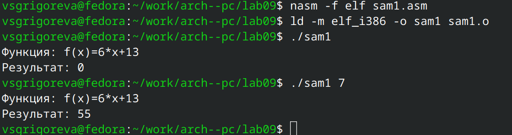{#fig:31.png width=0.7\textwidth}

2. В листинге 9.3 приведена программа вычисления выражения (3 + 2) ∗ 4 + 5. При запуске данная программа дает неверный результат. Проверьте это. С помощью отладчика GDB,анализируя изменения значений регистров, определите ошибку и исправьте ее.

Я ввела текст программы из листинга 9.3 в файл sam2.asm, создала исполняемый файл и запустила gdb (Рисунок 3.2).

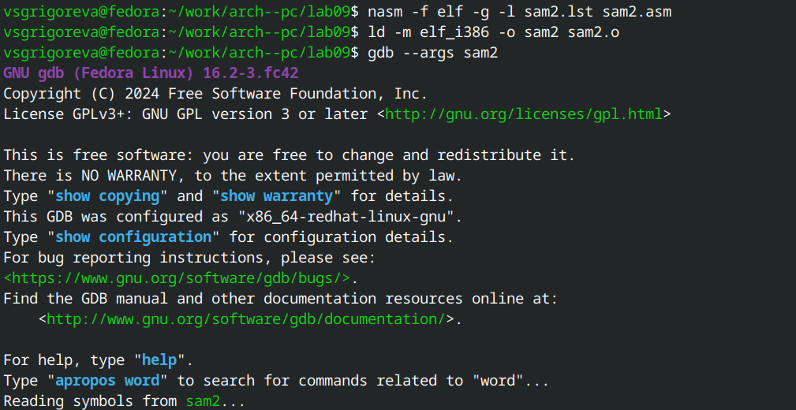{#fig:33.png width=0.7\textwidth}

Затем я установила брейкпоинт на метку _start и запустила программу (Рисунок 3.3).

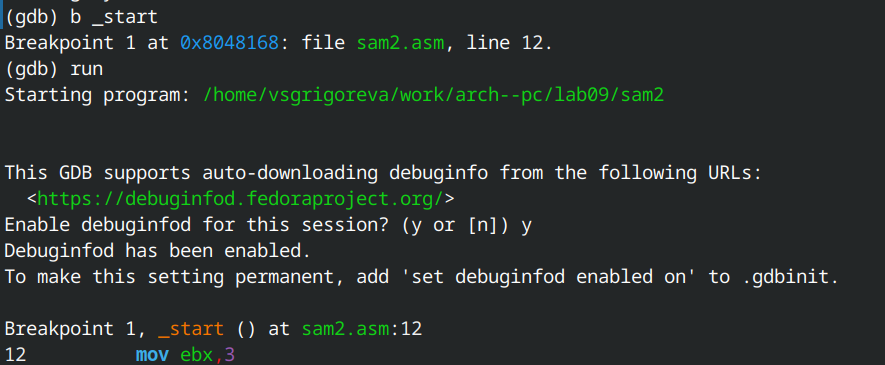{#fig:34.png width=0.7\textwidth}

Далее с помощью команды stepi проследила за изменением значений регистров (Рисунок 3.4).

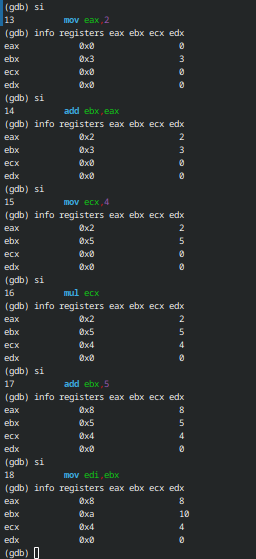{#fig:35.png width=0.7\textwidth}

Я определилиа ошибку и исправила ее.

```nasm
%include 'in_out.asm'

    SECTION .data
    div: DB 'Результат: ',0

    SECTION .text
    GLOBAL _start
    _start:

; ---- Вычисление выражения (3+2)*4+5

    mov ebx,3
    mov eax,2
    add ebx,eax
    mov ecx, 4
    mov eax, ebx
    mul ecx
    add eax,5
    mov edi,eax

; ---- Вывод результата на экран
    mov eax,div
    call sprint
    mov eax,edi
    call iprintLF
    call quit
```

Затем создала исполняемый файл и запустила его (Рисунок 3.5). 

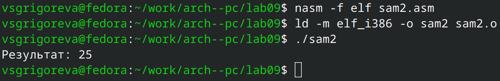{#fig:36.png width=0.7\textwidth}

Исправленная программа корректно посчитала значение выражения.

# Вывод

В ходе выполнения работы были приобретены навыки написания программ с использованием подпрограмм, я познакомилась с методами отладки при помощи GDB и его основными возможностями.
