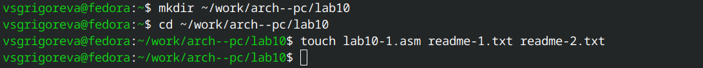
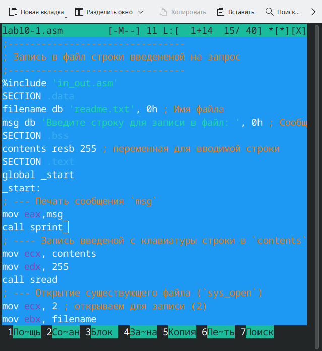
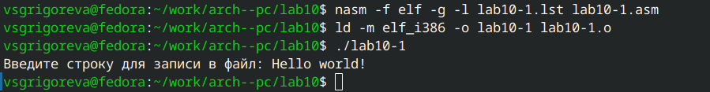
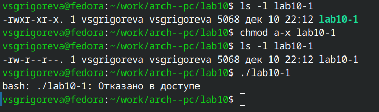
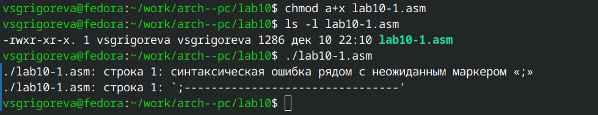
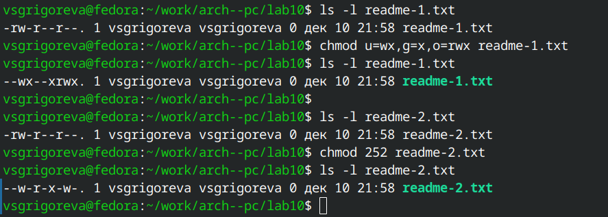
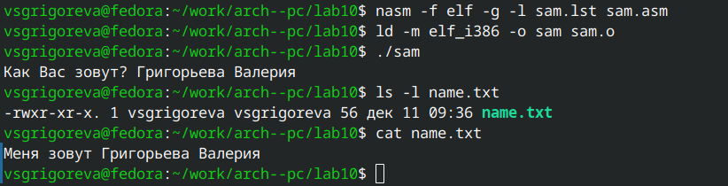

---
## Front matter
title: "Отчёт по лабораторной работе №10"
subtitle: "Выполнила студентка НКАбд-02-25"
author: "Валерия Сергеевна Григорьева"

## Generic otions
lang: ru-RU
toc-title: "Содержание"

## Bibliography
bibliography: bib/cite.bib
csl: pandoc/csl/gost-r-7-0-5-2008-numeric.csl

## Pdf output format
toc: true # Table of contents
toc-depth: 2
lof: false # List of figures
lot: false # List of tables
fontsize: 12pt
linestretch: 1.5
papersize: a4
documentclass: scrreprt
## I18n polyglossia
polyglossia-lang:
  name: russian
  options:
  - spelling=modern
  - babelshorthands=true
polyglossia-otherlangs:
  name: english
## I18n babel
babel-lang: russian
babel-otherlangs: english
## Fonts
mainfont: "Liberation Serif"
romanfont: "Liberation Serif"
sansfont: "Liberation Sans"
monofont: "Liberation Mono"
mainfontoptions: Ligatures=TeX
romanfontoptions: Ligatures=TeX
sansfontoptions: Ligatures=TeX,Scale=MatchLowercase
monofontoptions: Scale=MatchLowercase,Scale=0.9
## Biblatex
biblatex: true
biblio-style: "gost-numeric"
biblatexoptions:
  - parentracker=true
  - backend=biber
  - hyperref=auto
  - language=auto
  - autolang=other*
  - citestyle=gost-numeric
## Pandoc-crossref LaTeX customization
figureTitle: "Рис."
tableTitle: "Таблица"
listingTitle: "Листинг"
lofTitle: "Порядок проведения лабораторной работы"
lotTitle: "Вывод"
lolTitle: "Листинги"
## Misc options
indent: true
header-includes:
  - \usepackage{indentfirst}
  - \usepackage{float} # keep figures where there are in the text
  - \floatplacement{figure}{H} # keep figures where there are in the text
---
# Цель работы
Цель данной работы - приобретение навыков написания программ для работы с файлами.

# Порядок выполнения лабораторной работы

Для начала работы я создала каталог для лабораторной работы №10, перешла в него и создала файлы lab10-1.asm, readme-1.txt и readme-2.txt (Рисунок 2.1).

{#fig:1.png width=0.7\textwidth}

Затем я ввела его в файл lab10-1.asm текст программы из листинга 10.1 (Рисунок 2.2). Данная программа записывает в файл сообщение. 

{#fig:2.png width=0.7\textwidth}

Далее создала исполняемый файл и запустила его (Рисунок 2.3). 
Для корректной работы программы скопировала файл in_out.asm в каталог с файлом lab10-1.asm.

{#fig:3.png width=0.7\textwidth}

Программа корректно выполнила свою работу, записала сообщение в файл и завершила работу.

Затем я с помощью команды ls -l проверила права доступа к исполняемому файлу lab10-1, далее, используя команду chmod, изменила права доступа к исполняемому файлу, запретив его выполнение, и снова проверила права доступа. Далее я попыталась запустить файл, но терминал отказал в доступе (Рисунок 2.4). Так произошло, потому что право x было снято, и операционная система запретила выполнение программы.

{#fig:4.png width=0.7\textwidth}

Далее с помощью команды chmod изменила права доступа к файлу lab10-1.asm с исходным текстом программы, добавив право на выполнение. Затем попыталась выполнить его, но терминал выдал синтаксическую ошибку (Рисунок 2.5). Так произошло, потому что запущенный файл является текстовым с исходным кодом на ассемблере, а не исполняемым файлом, а запущен операционной системой может быть только исполняемый файл.

{#fig:5.png width=0.7\textwidth}

Затем я предоставила права доступа к файлу readme-1.txt представленные в символьном виде, а для файла readme-2.txt – в двочном виде в соответствии с 15 вариантом (-wx --x rwx, 010 101 010). Затем я проверила правильность выполнения с помощью команды ls -l (Рисунок 2.6).

{#fig:6.png width=0.7\textwidth}

# Задание для самостоятельной работы

1. Напишите программу работающую по следующему алгоритму:
• Вывод приглашения “Как Вас зовут?”
• ввести с клавиатуры свои фамилию и имя
• создать файл с именем name.txt
• записать в файл сообщение “Меня зовут”
• дописать в файл строку введенную с клавиатуры
• закрыть файл
Создать исполняемый файл и проверить его работу. Проверить наличие файла и его содержимое с помощью команд ls и cat.

Я написала программу: 

```nasm 
%include 'in_out.asm'

SECTION .data
    ask_msg     db 'Как Вас зовут? ', 0h
    prefix      db 'Меня зовут ', 0h
    prefix_len  equ $ - prefix - 1
    filename    db 'name.txt', 0h
    nl          db 10

SECTION .bss
    contents    resb 255

SECTION .text
global _start

_start:
    mov eax, ask_msg
    call sprint

    mov ecx, contents
    mov edx, 255
    call sread

    mov ecx, 0777o
    mov ebx, filename
    mov eax, 8
    int 80h
    mov esi, eax

    mov eax, 4
    mov ebx, esi
    mov ecx, prefix
    mov edx, prefix_len
    int 80h

    mov eax, contents
    call slen

    test eax, eax
    jz .no_trim
    mov ebx, eax
    dec ebx
    mov bl, [contents + ebx]
    cmp bl, 10
    je .trim_ok
    cmp bl, 13
    jne .no_trim
.trim_ok:
    dec eax
.no_trim:

    mov edx, eax
    mov ecx, contents
    mov ebx, esi
    mov eax, 4
    int 80h

    mov eax, 4
    mov ebx, esi
    mov ecx, nl
    mov edx, 1
    int 80h

    mov ebx, esi
    mov eax, 6
    int 80h

    call quit
```

Далее я создала исполняемый файл, проверила его работу и наличие файла с помощью команд ls и cat (Рисунок 3.1). Программа корректно выполнила свою работу и записала в файл строку, введенную клавиатуру.

{#fig:7.png width=0.7\textwidth}

# Вывод

В ходе выполнения лабораторной работы я приобрела навыки написания программ для работы с файлами.

